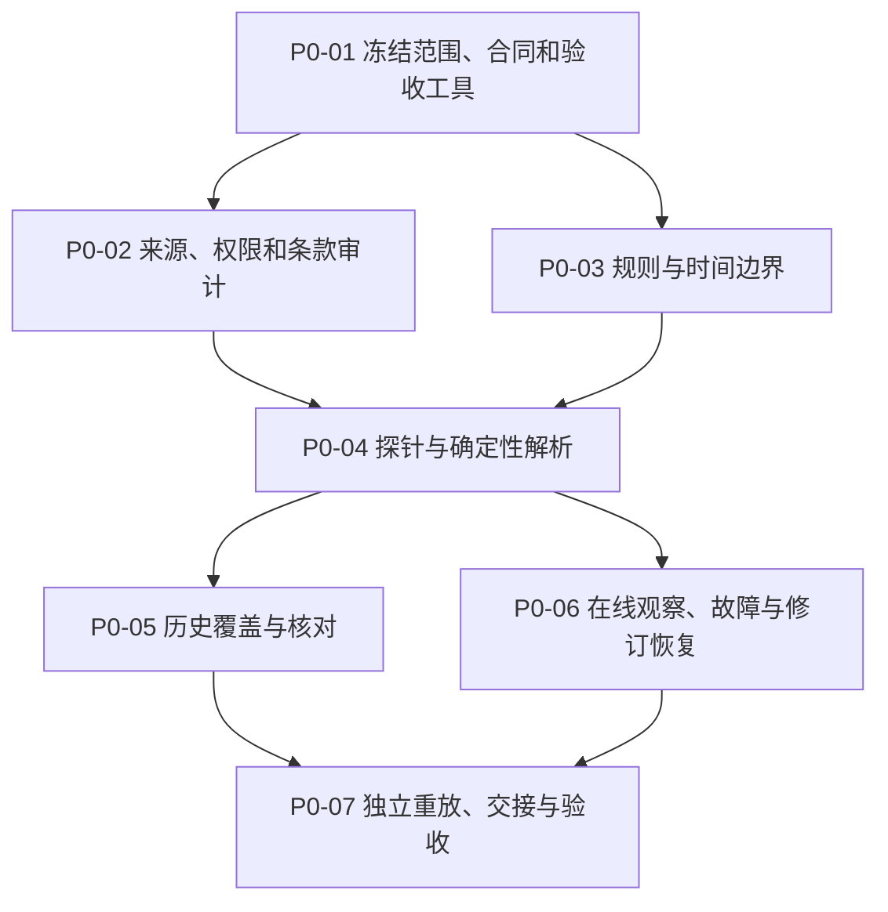

# 阶段 0：官方开奖数据可行性验证计划

## 文档状态

| 项目 | 内容 |
| --- | --- |
| 版本 | 1.3 |
| 状态 | 可以开始 P0-01；P0-02 在范围冻结完成前保持阻塞 |
| 阶段目标 | 证明大乐透和双色球的官方开奖事实能够在不绕过访问控制的前提下，被自动获取、正确解释、保留原始证据、处理官方修订并独立重放 |
| 验收对象 | 数据可行性与证据链，不是长期生产可用性 |
| 机器可读合同 | `docs/roadmap/phase-0-acceptance-contract.json` |
| 执行任务合同 | `tasks/research/v1.0.0-lottery-autoresearch-roadmap/research-planning.json` 中的 `TASK-001` |
| 上游依据 | `docs/research/lottery-autoresearch-technical-strategy.md` |
| 下游消费者 | 阶段 1 历史数据管线与 M0 基线系统 |

## 本次修复的根因

上一版计划仍有三个系统性问题：

1. **“机器可读”没有落实为“机器可验”。** 产物格式、Schema、规范序列化、解析器身份和一键验证命令没有闭合，哈希相同与否不能被第三方稳定复算。
2. **验收边界可能在看到结果后改变。** “支持区间”、历史核对样本、在线观察请求和重试预算没有事前冻结，失败后缩短区间也可能被写成通过。
3. **状态和决策不是确定函数。** 没有完整修订门、当前视图生成规则、独立复核身份约束和唯一项目决策顺序；临时活动也被错误建模成单值版本。

这不是补几句话能解决的问题。修复方案是：先冻结范围，再依据 JSON Schema 生成证据；所有派生记录使用统一规范化和内容哈希；用追加式事件表达修订；最后由未参与解析器编写的复核人用唯一命令重建全部结论。

## 讲人话的目标

阶段 0 只回答一件事：

> 我们能否不用人工抄写或修改号码，持续获得两个彩种的官方开奖事实，并证明每条数据从哪里来、何时取得、如何解析、是否被更正？

阶段 0 不承诺数据源长期不变，也不承诺彩票可预测。它需要证明：

- 当前存在权威且可合规访问的发布渠道；
- 采集、解析、核对、修订和失败检测链路可行；
- 任何未知、缺失或冲突都显式暴露；
- 阶段 1 能只依赖已冻结合同消费数据，不需要隐藏的人工转换。

## 真实性边界

《彩票管理条例》要求彩票发行和销售机构及时向社会公布销售情况及开奖结果，但没有要求提供公开、稳定、机器可读的历史 API。因此，网页公开、机器可取和接口稳定是三个不同事实，必须分别验证。

当前官方证据还表明，财政部在 2025 年 12 月分别批准了双色球和大乐透规则变更。规则变更可能只影响奖级，也可能影响开奖流程；不能用单一 `rule_version` 混合不同变化。

权威依据：

- 彩票管理条例：https://www.samr.gov.cn/zw/zfxxgk/fdzdgknr/bgt/art/2023/art_a76abb6a4f7445f883f7d2da0d52607d.html
- 大乐透现行规则：https://m.lottery.gov.cn/ksjz/m/yxgz_dlt/
- 大乐透规则变更审批：https://www.mof.gov.cn/gp/xxgkml/zhs/202601/t20260116_3982042.htm
- 双色球规则变更审批：https://www.mof.gov.cn/gp/xxgkml/zhs/202601/t20260116_3982040.htm

## 开工前冻结：防止事后挑口径

P0-01 必须先生成 `artifacts/phase-0/scope-freeze.json`、`observation-plan.json` 和 `reviewer-assignment.json`。`reviewer-assignment.json` 只冻结复核人身份、角色隔离和独立性声明；`reviewer-attestation.json` 是 P0-07 重放完成后的签署结果，两者不得混用或覆盖。在 P0-01 三份冻结文件完成前不得开始 P0-02 的来源结果观察。

需要按彩种冻结：

- 目标历史区间和最低可接受历史区间；
- 以 UTC 表示的验收截止时刻；
- 历史核对的分层、样本量依据、随机种子和期号集合；
- 覆盖至少两个完整开奖周期的计划请求集合；
- 请求频率、重试次数和总请求预算；
- 时钟来源及最大允许偏差；
- 执行人、解析器作者、验收人及其独立性声明。

冻结后可以增加证据，但不得因为来源表现不佳而缩短区间、换样本、放宽预算或改验收门。确需变更时，必须停止当前批次，提升合同版本，说明原因，并用新批次从头执行；旧证据和旧结论不得覆盖。

合同中目前为 `null` 的区间、截止时间等值不是缺失设计，而是 P0-01 必填槽位。只要仍有必填值为 `null`，G-SCOPE 必须失败，P0-02 不得启动。

## 统一术语

| 术语 | 定义 | 不代表 |
| --- | --- | --- |
| 权威主发布源 | 对该彩种开奖结果负有正式发布职责的官方机构或其正式渠道 | 稳定 API |
| 官方核对渠道 | 另一个官方发布页面、公告、视频或省级渠道 | 独立生成真值 |
| 机器可读来源 | 无人工识别即可确定性解析的文本、结构化响应或文件 | 官方承诺长期兼容 |
| 原始快照 | 实际存储的响应载荷字节、批准保留的响应元数据、请求与最终地址、获取时间及校验值 | 解码或解析后的文本 |
| 规范记录 | 指定解析器从原始快照产生、经 RFC 8785 规范化的统一 JSON 记录 | 官方原文 |
| 核心事实 | 彩种、期号、开奖时间、各分区开奖号码及对应官方证据 | 奖金、销量或预测特征 |
| 未核实 | 权威性尚未建立、存在未解决冲突、解析失败或证据不足 | 可以进入训练的有效记录 |
| 可行性观察 | 覆盖最少开奖周期的功能和恢复验证 | 长期生产 SLO |

单一来源不等于未核实：如果它是权威主发布源，且来源权威性、原始证据、确定性解析和独立重放均通过，记录可以是 `verified`，但佐证置信层级必须标为 `primary_only`，不得宣称已获独立佐证。

## 状态与修订模型

记录状态为 `unavailable`、`unverified`、`verified`、`conflicted`、`invalid`。状态通过追加事件变化，旧事件不得删除或改写。

允许的状态迁移：

- `unavailable → unverified`
- `unverified → verified | conflicted | invalid | unavailable`
- `verified → verified | conflicted`
- `conflicted → verified | invalid`
- `invalid → unverified`

每次迁移必须引用新的不可变证据快照或已批准的解析器产物，并记录原因码、操作者身份和 UTC 时间。`verified → verified` 只用于有新官方证据但核心事实不变的重新确认。

当前有效视图必须由明确的优先级、`supersedes` 引用和时间规则确定性生成。任何历史时点都必须能够重建当时视图；官方更正或解析器修正不能覆盖旧快照。阶段 0 必须用一个合成更正案例验证“更正前、发生更正、按新解析器重处理、恢复历史视图”四条路径；观察到真实官方更正时，还必须完整重放真实案例。

## 规则模型

阶段 0 使用三个单值规则轴和一个多值活动集合：

| 规则维度 | 基数 | 包含内容 | 对预测的影响 |
| --- | --- | --- | --- |
| `number_space_version` | 恰好一个 | 分区、号码范围、选取数量、是否重复、结果是否有序 | 决定合法组合空间，属于硬边界 |
| `draw_process_version` | 恰好一个 | 开奖日、停售时间、摇奖流程、结果发布流程 | 决定时间分段和可能的机制变化 |
| `prize_rule_version` | 恰好一个 | 奖级、奖金比例、固定奖和浮动奖规则 | 通常不改变号码概率，不能单独触发重新训练 |
| `active_promotion_ids` | 零个或多个 | 同期生效的派奖、特别规定及临时活动 ID | 影响奖金解释，不进入号码生成概率 |

每一期必须唯一映射到一个完整 rule bundle。只有 `number_space_version` 或有证据支持的 `draw_process_version` 变化，才能被视为号码生成过程变化。多个活动允许重叠，不能压缩为一个单值活动版本。

## 时间模型

| 字段 | 定义 | 填写规则 |
| --- | --- | --- |
| `draw_at` | 实际开奖时间 | 只取官方明确记录 |
| `page_published_at` | 官方页面明确显示的发布时间 | 未显示则为空 |
| `http_date` | HTTP 响应头时间 | 不得代替发布时间 |
| `first_seen_at` | 系统第一次发现该内容的时间 | 由本系统记录 |
| `retrieved_at` | 本次请求完成时间 | 每个快照必填 |
| `corrected_at` | 官方更正时间 | 只有明确官方证据时填写 |
| `available_at` | 某字段最早可供系统可靠使用的时间 | 取可证明时间，不猜测 |

所有系统生成时间使用 RFC 3339 UTC `Z` 格式。每次在线运行必须记录最近一次时钟核验；超过冻结的最大偏差时，该次运行无效。

如果只能证明 `first_seen_at`，不得反推 `page_published_at`。历史数据只有开奖日期而没有可用时间时，可以作为结果标签，但不能自动作为开奖前特征。

## 序列化、哈希与执行环境

- 原始载荷哈希：对实际存储、字符解码前的载荷字节计算 SHA-256；同时记录是否发生 HTTP 内容解码及 `Content-Encoding`。
- 规范记录：UTF-8 无 BOM，按 RFC 8785 JSON Canonicalization Scheme 序列化后计算 SHA-256。
- 核心彩票号码：保留前导零的字符串；金额使用十进制定点字符串，不使用二进制浮点数。
- Unicode：保留原始字节；规范字段采用何种 Unicode 正规化必须在 `field-contract.json` 中逐项声明。
- 解析器身份：使用不可变源码或二进制包的 `parser_artifact_sha256`；可修改的版本字符串不能单独证明解析器身份。
- 环境身份：`environment-lock.json` 固定运行时、依赖、操作系统、区域设置和时区。
- 验证入口：`verification-command.json` 给出一条非交互命令，从空派生目录执行 Schema 校验、重放、哈希、覆盖、核对、修订及全部硬门。

本工作区当前没有可依赖的 Git 元数据，因此验收不能要求 Git commit。可信性由合同版本、产物内容哈希、解析器产物哈希、环境锁和独立复核共同建立；未来若初始化 Git，可以追加提交 ID，但不能替代上述证据。

## 响应元数据与秘密保护

- 探针不得发送 `Authorization`、`Cookie` 或 `Proxy-Authorization`。
- 响应元数据只允许保留：`Content-Type`、`Content-Length`、`Content-Encoding`、`Date`、`ETag`、`Last-Modified`、`Cache-Control`、`Location`。
- 不得持久化 `Set-Cookie`、`Authentication-Info`、`Proxy-Authentication-Info` 或其他秘密。
- 必须记录初始 URL、每次重定向状态和最终 URL。
- 清单记录被移除的响应头名称和脱敏策略版本，但不能把秘密本身或秘密哈希写入可共享产物。

## 证据等级与核对范围

| 等级 | 证据 | 用途 |
| --- | --- | --- |
| A | 国家级发行机构正式规则、开奖公告或正式结构化数据 | 主事实源 |
| B | 省级官方机构、官方直播、正式公告镜像 | 核对和补充 |
| C | 官方页面中由图片、视频或动态脚本呈现的数据 | 保存载体并独立核对 |
| D | 第三方网站、媒体或社区数据 | 只能发现问题，不得成为最终真值 |

多个官方渠道可能共享同一上游。报告必须记录机构、传输路径和已知依赖，不能将“两个页面一致”表述为“两个独立真值一致”。

每条记录还必须声明一个与覆盖层级分离的 `corroboration_tier`：

| 佐证置信层级 | 判定条件 | 允许的结论 |
| --- | --- | --- |
| `corroborated_official` | 权威主发布源与可用的官方核对渠道核心事实一致，且已披露上游依赖 | 可说明“官方渠道已核对” |
| `shared_upstream` | 两个官方渠道一致，但已知或合理判断共享上游 | 只能支持采集和解析一致性，不能声称独立真值 |
| `primary_only` | 权威主发布源、完整溯源和重放均通过，但没有可用的官方核对渠道 | 可以证明官方数据可采集；必须显式披露佐证不足 |

第二官方渠道不可用会降低佐证置信度，但不会单独否定“官方开奖数据可行”。无论哪一层级，都不得用第三方来源替代最终真值。

交接夹具中的 `corroboration_tier` 是按彩种汇总的映射：每个彩种给出已接受记录中的最低佐证层级、各层级记录数和计算证据引用；逐条规范记录仍保留各自的单一层级。它不能用一个“最佳层级”掩盖较弱记录。

核对范围固定为：

- 在线观察：有可用官方核对渠道时核对每一个实际开奖；不可用时保留完整主源证据并标为 `primary_only`；
- 历史数据：有可用官方核对渠道时，核对全部规则边界期、全部异常或冲突期，以及 P0-01 事前冻结的分层随机样本；不可用部分按同一冻结样本报告覆盖缺口；
- 样本合同：分层、样本量依据、随机种子、选中期号和共享上游判断必须全部留档。

## 阶段范围

### 包含

- 官方来源、核对渠道和访问约束调查；
- 核心字段、时间语义、状态机和规则版本定义；
- JSON Schema、规范序列化、哈希和验证命令；
- 原始字节快照、确定性解析和规范记录；
- 目标及最低区间的集合对账、缺期分类和事前样本核对；
- 短期在线观察、计划/实际请求对账、失败注入和恢复验证；
- 修订链、证据清单、独立重放和唯一阶段决策；
- 阶段 1 消费夹具验证。

### 不包含

- 生产数据库和分布式调度；
- 全量生产回填和长期可用性承诺；
- 模型训练、特征工程和 1000 组预测；
- OCR 结果直接作为未经核对的真值；
- 绕过验证码、登录、令牌、限流或其他访问控制；
- 自动购彩、收益承诺或中奖保证。

## 工作包

### P0-01：冻结范围、合同和验收工具

目的：在查看来源表现和历史结果前，固定“验证什么、怎么验证、由谁验证”。

工作：

- 审查并批准验收合同 v1.3；
- 填完两个彩种的目标区间、最低区间、UTC 截止时间；
- 冻结历史核对样本、在线观察请求、访问/重试预算和时钟容差；
- 冻结状态机、项目决策顺序、执行人和独立复核人，并生成事前 `reviewer-assignment.json`；
- 为全部机器产物建立 JSON Schema 2020-12；
- 冻结规范序列化、哈希、环境锁和唯一验证命令；
- 建立需求—证据—硬门映射。

通过标准：

- G-SCOPE 所需值无 `null`，三份冻结文件通过 Schema；
- 所有硬门都有明确证据键、二元判定和失败原因；
- 验证命令、运行前提和预期退出码已登记；
- 合同版本及所有 Schema 已计算内容哈希；
- P0-02 开始条件可由机器判定，不能靠口头批准。

### P0-02：来源、权限和条款审计

目的：找到权威主发布源，评估可用的官方核对渠道，并确认允许的访问方式。

工作：

- 为每种彩票建立来源目录；
- 记录机构、URL、内容类型、历史查询能力、动态加载、登录/验证码、robots、条款、版权说明、频率限制和重定向；
- 标记权威等级、机器可读性和已知共享上游；
- 仅按冻结的低频计划测试无需绕过控制的访问方式；
- 合规存在实质性疑问时升级为 HOLD，不由开发者自行给出法律结论。

通过标准：

- 每种彩票至少一个权威主发布源；
- 每种彩票都完成官方核对渠道可用性和共享上游评估，并能为记录分配 `corroborated_official`、`shared_upstream` 或 `primary_only`；缺少第二官方渠道不能被误报为独立佐证，也不单独导致失败；
- 不使用未授权凭据，不绕过技术限制，不持久化秘密；
- 每个来源都有检查日期、条款证据、允许访问策略和责任人。

### P0-03：规则与时间边界

目的：防止用当前规则解释历史期号，或把奖级/活动变化误认为号码生成变化。

工作：

- 建立三个单值规则轴和 `active_promotion_ids`；
- 收集每次变更的批准文件、公告、上市日期和边界期号；
- 区分已排序公布号码与实际摇出顺序；
- 定义七个时间字段的来源和空值规则；
- 使用所有规则边界前后期号验证映射。

通过标准：

- 冻结区间内每一期唯一映射到一个完整 rule bundle；
- 未解释规则空档为 0；
- 奖金和活动规则不冒充号码空间或开奖流程变化；
- 重叠活动可以同时表达；
- 不伪造发布时间或摇出顺序。

### P0-04：最小数据探针与确定性解析

目的：证明原始证据能够被确定性转成规范记录，并在异常时安全失败。

数据探针必须：

1. 保存请求方法、初始/最终 URL、重定向链、请求完成时间、HTTP 状态和允许保留的响应元数据；
2. 保存未经字符解码的实际载荷字节及 SHA-256；
3. 将 HTTP 内容解码、字符解码和字段解析分开记录；
4. 记录输入快照哈希、`parser_artifact_sha256`、环境锁哈希和规范输出哈希；
5. 根据当期 `number_space_version` 校验号码；
6. 按冻结范围使用可用的官方核对渠道比较；无可用渠道时标为 `primary_only` 并保留渠道评估证据；
7. 输出明确状态，冲突时不得生成 `verified`；
8. 禁止直接人工改写核心号码；
9. 执行秘密检测和响应头白名单检查。

通过标准：

- 相同原始载荷、解析器产物、环境锁和规范化规则产生相同记录哈希；
- 缺字段、重复或越界号码、乱码、未核对 OCR、页面结构变化均安全失败；
- 人工核心号码改写次数为 0；
- 单一来源失败不会被备用来源静默冒充；
- 所有机器产物先通过 Schema，再进入语义验收。

### P0-05：历史覆盖与核对

目的：对事前冻结的区间做集合证明，不允许失败后缩短口径。

工作：

- 根据官方开奖日历、休市公告和规则时间线生成预期期号集合；
- 枚举实际可取得的期号集合；
- 分别对目标区间和最低区间输出缺失、重复、额外、规则边界异常和无法解释期号；
- 在官方核对渠道可用的范围内，核对所有规则边界、全部异常/冲突和事前冻结的分层样本；不可用部分保持原样本并报告 `primary_only` 覆盖；
- 保存每个结论到原始官方证据的引用。

通过标准：

- 两个区间的预期、实际、缺失和异常集合均可复算；
- 目标区间完整才可 `PASS_FULL`；最低区间完整且目标缺口全部分类才可 `PASS_LIMITED`；
- 所有存在官方核对证据的规定核对项，其未解决核心号码冲突为 0；`primary_only` 记录不得宣称独立核对；
- 任何第三方补数保持 D 级，不能进入 `verified`；
- 区间与样本没有在观察结果后改变。

### P0-06：在线观察、失败注入与修订恢复

目的：证明当前链路能按计划工作、发现失效、处理更正并恢复，不宣称长期稳定。

观察按冻结计划覆盖每种彩票至少两个完整开奖周期，并持续到冻结的验收截止时刻。

工作：

- 按 `observation-plan.json` 执行每一个计划请求；
- 逐项对账计划请求与实际请求，记录漏跑、额外请求和原因；
- 记录首次发现、内容补全、来源延迟、重试、时钟核验和内容变化；
- 有可用官方核对渠道时对每次实际开奖执行核对；否则保留主源完整证据并标为 `primary_only`；
- 注入超时、非 200、空正文、字符集错误、DOM/JSON 字段变化和重复响应；
- 验证失败时不产生有效记录，来源恢复后可由原始证据补抓和重放；
- 执行合成官方更正与解析器重处理案例；若出现真实更正则完整重放。

通过标准：

- 每个计划请求都有执行记录或分类原因，预算未在失败后放宽；
- 所有实际开奖最终为 `verified` 或有明确未通过原因；
- 时钟超过容差的运行被判无效；
- 注入失败不会生成静默有效记录，临时失败不会形成未解释永久缺期；
- 当前视图和任意历史视图能够确定性重建；
- 两个周期仅作为可行性证据，长期成功率与 SLO 交由阶段 1。

### P0-07：独立重放、交接验证与阶段验收

目的：由未参与解析器编写且未修改被审证据的人，从原始快照重建所有结论。

工作：

- 从空派生数据目录和冻结环境开始；
- 执行 `verification-command.json` 中唯一命令；
- 验证 Schema，读取 evidence manifest 和原始快照；
- 重建规范记录、哈希、规则映射、覆盖、核对、修订链和硬门；
- 使用阶段 1 夹具按公开字段合同完成一次消费；
- 夹具必须显式给出 `active_games`、`excluded_games`、`per_game_outcome`、`coverage_tier`、`corroboration_tier` 和 `evidence_ref`；只有 `PASS_FULL` 或 `PASS_LIMITED` 的彩种可进入 `active_games`；
- 分别判定两个彩种，再按规定顺序聚合唯一项目决策；
- 由复核人签署身份、独立性、输入哈希、命令、退出码和结论。

通过标准：

- 独立重放命令退出码为 0，并得到相同规范记录哈希和硬门结论；
- 所有 PASS 均能定位到原始证据；
- 复核人没有编写解析器或修改被审证据；
- 阶段 1 夹具不需要未记录字段或人工转换；
- 两个彩种都恰好出现在 `active_games` 或 `excluded_games` 之一，且彩种结论、覆盖层级、佐证置信层级和证据引用与硬门结果一致；
- 恰好输出一个项目决策。

## 执行顺序



P0-01 未通过，其他工作包全部阻塞。P0-02 与 P0-03 可并行；P0-05 与 P0-06 在 P0-04 通过后可并行；P0-07 必须等待两者完成。

## 计划产物与证据链

所有机器产物使用 JSON 或 JSONL，并在 `artifacts/phase-0/schemas/` 中有对应 JSON Schema 2020-12：

| 产物 | 作用 |
| --- | --- |
| `schemas/` | 全部机器产物的版本化 Schema |
| `scope-freeze.json` | 目标/最低区间、截止时间、历史核对样本和冻结状态 |
| `source-catalog.json` | 来源权威性、访问方式、条款、依赖和机器可读性 |
| `field-contract.json` | 核心字段、状态、时间、Unicode 和空值规则 |
| `rule-bundles.json` | 三个单值规则轴、活动集合及期号映射 |
| `observation-plan.json` | 计划请求集合、预算、周期、时钟和截止时间 |
| `reviewer-assignment.json` | P0-01 事前冻结的复核人身份、角色隔离与独立性声明 |
| `environment-lock.json` | 运行时、依赖、操作系统、区域设置和时区 |
| `verification-command.json` | 独立重放的唯一命令、前提和预期退出码 |
| `evidence-manifest.jsonl` | 每条结论到原始证据、解析器和输出哈希的索引 |
| `raw/` | 原始载荷和批准保留的响应元数据，只追加 |
| `normalized/` | RFC 8785 规范记录与输出哈希 |
| `reconciliation.jsonl` | 主源与核对渠道逐字段差异及覆盖标记 |
| `coverage-report.json` | 两个冻结区间的预期、实际、缺失、重复和异常期号集合 |
| `revision-report.json` | 修订事件、supersession、当前视图和历史重建结果 |
| `soak-run-log.jsonl` | 计划/实际请求、时钟、延迟、重试、注入和恢复 |
| `replay-report.json` | 独立重放输入、输出、哈希、硬门和退出码 |
| `reviewer-attestation.json` | P0-07 重放后的复核人身份、独立性、输入哈希、命令、退出码与签署结论 |
| `stage1-handoff-fixture.json` | 阶段 1 的最小消费样例；声明 `active_games`、`excluded_games`、逐彩种结论、覆盖层级、佐证置信层级及证据引用 |
| `phase-0-acceptance-report.md` | 人类可读的逐门证据与最终决策 |

完整链路为：

```text
事前范围冻结
  → 官方发布渠道与合规访问
  → 原始载荷字节、批准元数据与 SHA-256
  → parser_artifact_sha256 与 environment-lock
  → RFC 8785 规范记录及输出哈希
  → rule bundle、状态事件与修订链
  → 事前核对样本、全量集合对账与在线计划对账
  → 独立一键重放及阶段 1 夹具
  → active/excluded 彩种范围
  → 每彩种结论和唯一项目决策
```

## 硬门与决策规则

验收合同定义 14 个硬门：G-SCOPE、G-AUTHORITY、G-COMPLIANCE、G-SCHEMA、G-PROVENANCE、G-RULES、G-TIME、G-PARSE、G-CORRECTNESS、G-COVERAGE、G-REVISION、G-RECOVERY、G-REPRODUCIBILITY、G-HANDOFF。任一隐藏、未分类或互相矛盾的门结果都按失败处理。

先分别按顺序判定每个彩种，命中第一条后停止：

- `PASS_FULL`：除覆盖外的所有门通过，且目标区间通过 G-COVERAGE。
- `PASS_LIMITED`：除覆盖外的所有门通过，最低区间通过 G-COVERAGE，目标区间缺口全部分类。
- `STOP`：不能通过，且在穷尽已审计的合规替代方案后，官方真值仍只能靠第三方替代、必须绕过访问控制，或不存在证据路径。
- `HOLD`：不能通过、未命中 STOP，但至少一个失败门存在明确、合规、可执行的修复路径。

顺序是 `PASS_FULL → PASS_LIMITED → STOP → HOLD`。如果四项均不匹配，说明硬门分类不完整，阶段验收直接失败。

再按以下顺序匹配，命中第一条后停止：

1. 两个彩种均 `PASS_FULL` → `GO`。
2. 至少一个彩种为 `PASS_FULL` 或 `PASS_LIMITED`，且不满足 GO → `LIMITED_GO`。
3. 没有彩种通过，且至少一个为 `HOLD` → `HOLD`。
4. 两个彩种均为 `STOP` → `STOP`。

最终必须且只能输出一个项目决策。

`PASS_FULL`/`PASS_LIMITED` 描述历史期号覆盖范围，`corroborated_official`/`shared_upstream`/`primary_only` 描述佐证置信度；两套维度必须分别报告，不能互相替代。

## 下游交接条件

阶段 1 只有在 G-HANDOFF 通过后，才能消费：

- 状态为 `verified` 的核心开奖事实和完整状态事件；
- 已批准的来源目录和访问策略；
- 完整 rule bundle、活动集合与七字段时间语义；
- 能从原始快照按冻结环境重放的规范记录；
- 明确区分的目标区间和最低可行区间；
- 每个彩种及记录的佐证置信层级与官方核对渠道可用性说明；
- 阶段 0 验收报告中的未关闭风险；
- 已通过 Schema 和一键消费测试的交接夹具。

阶段 1 不得把两个开奖周期解释为长期 SLO，不得擅自扩大历史支持区间，也不得把未核实数据或第三方补数用于训练。
