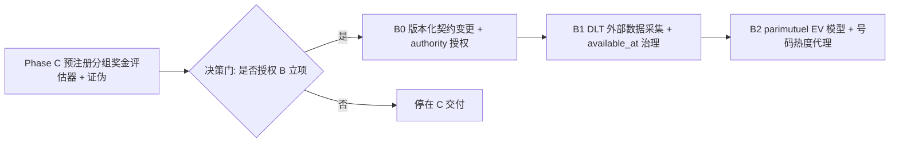

# Phase 4 C+B 技术路线：总体方案与详细计划

## 1. 背景与目标

业务目标是把双色球（SSQ）与超级大乐透（DLT）预测模型的"分组内每注平均奖金"提升到 > 2 元（即每注 2 元票价的回本线）。

已论证并冻结的关键结论（详见 `docs/phase4/prize-calculation-contract.md` 与 `docs/phase4/prize-calculation-contract.md` 冻结口径）：

1. 在冻结固定奖金契约下，每注期望奖金恒为 SSQ 0.8531 元 / DLT 0.8817 元；庄家抽水约 57% / 56%。
2. 均匀开奖下每一注期望奖金相同，因此**任何选号、排序、分组覆盖、复式合买都无法改变分组内每注的期望平均奖金**，只能改变方差、中奖率与条件中奖额。
3. 要达到 2 元，需要约 2.34×（SSQ）/ 2.27×（DLT）的真实优势。这只能来自两条路径：
   - **路径 A（真实物理偏差）**：样本仅 200 期/彩种，所需偏置（~0.03 绝对）比 200 期噪声下限（~0.18）小一个数量级，统计上不可证伪；Phase 2 审计结论为 `indeterminate`。**不可行。**
   - **路径 B（parimutuel / 热门号规避）**：数学上唯一被证实的真实 EV 提升手段，但需要修改冻结奖金契约、引入外部销量/奖池数据、并估计号码级投注热度（官方不公布）。
   - **路径 C（分布/覆盖工程）**：不提升期望，但可在边界内把"每注平均奖金"做成可审计、可证伪的指标。
   - **路径 D（复式/合买）**：尺度不变，对目标无效。

## 2. 总体方案：C 先行，B 立项

采用"先 C 后 B"：先在冻结契约内完成 C（低成本、零治理、可立即落地），用其结果给 B 立项背书；随后把 B 作为需要授权的版本化契约变更立项。

## 3. 详细计划：Phase C（本阶段可交付）

### 3.1 目标定性

C 交付的是一个**预注册、可重放、可审计的"分组奖金评估器"**，用冻结奖金入口（`bonus.fixed_bonus` / `prize_metrics.group_prize_metrics`）对候选分组构造策略打分，并对"分组内每注平均奖金 > 2 元"给出诚实判定。**C 不承诺收益、不声称 lift**；其预期诚实结论是把该目标证伪（任何策略在冻结窗口的实现平均奖金在统计上 ≈ 0.85/0.88 元，远低于 2 元）。

### 3.2 预注册（先冻结，后执行）

- **策略集合**（全部静态、序列安全，不使用目标期开奖号）：
  1. `m0_uniform`：按规范字典序取前 K 注（均匀比较器，非产品）。
  2. `back_lock_coverage`：锁定一个后区（SSQ 蓝球 1 枚 / DLT 后区 2 枚固定组合），前区按规范字典序取前 K 注。
  3. `front_spread`：前区号码均匀铺开，固定后区，取前 K 注。
- **分组大小 K**：`1000`、`5000`、`10000`。
- **评估窗口**：每彩种冻结历史的后 120 期（与 e7/e8 冻结外窗一致）。
- **指标**：分组奖金总额、每注平均奖金、中奖率、各奖级命中注数（契约第 54 行口径）。
- **打分入口**：`lottery_system.phase4.prize_metrics.group_prize_metrics`，禁止复制奖级判断。

### 3.3 执行协议（walk-forward）

对评估窗口内每期 target：用该策略构造 K 注，与真实开奖号比对得到每注 `(front_hits, back_hits)`，调用 `group_prize_metrics` 计算该期该分组指标；聚合窗口得均值与 moving-block bootstrap 95% 区间，并报告相对 `m0_uniform` 的差。策略无待调参数，故不存在 selection 偏差；报告如实标注科学状态 `no_confirmed_lift`。

### 3.4 验收标准（对 C）

1. 脚本以退出码 0 运行，产出 artifacts；测试全绿。
2. 逐策略指标与 `full_space_oracle` 基线一致：每注期望奖金 = SSQ 0.8531 / DLT 0.8817（实现均值应在该值附近的统计噪声带内，绝不声称 > 2 元）。
3. 全部打分走冻结奖金入口；未修改 `bonus.py` 冻结表、未重新引入 DLT 新/旧规则、未引入任何收益/lift 承诺。
4. 交付物：脚本、测试、artifacts、`DELIVERY.md`，且仅修改本次任务相关文件。

### 3.5 交付物清单

- `scripts/phase4e23_group_prize_eval/run_group_prize_eval.py`
- `tests/phase4/test_phase4e23_group_prize_eval.py`
- `artifacts/phase4e23_group_prize_eval/`（逐策略/逐期指标 + summary.json）
- `docs/phase4e23/DELIVERY.md`（口径、预注册、结论、局限）

## 4. 详细计划：Phase B（立项材料，待授权后实施）

B 是唯一能提升真实 EV 的路径，但需要越界立项。立项材料应包含：

- **B0 契约与治理**：新版本化奖金契约 `SSQ_PRIZE_PARIMUTUEL_v1` / `DLT_PRIZE_PARIMUTUEL_v1`（仅一等奖两彩种、二等奖大乐透改为 parimutuel，低奖级固定值不变）；更新契约指纹、oracle、state-space-audit 与说明文档；新 authority freeze 解除 Phase 3"销售额/奖池/中奖注数不得进入预测"的禁令。
- **B1 外部数据采集**：DLT 走广东体彩静态页（含全国销售额、奖池、各奖级中奖注数、奖金），逐期建立 `available_at_utc < prediction_locked_at` 证明与 provenance；SSQ 需另寻获准来源，否则先只做 DLT。
- **B2 parimutuel EV 模型**：一等奖每注实得 ≈ f(奖池, 销量提成, 一等奖中奖注数)；择时杠杆（rollover 抬高全人群 EV）优先验证。
- **B3 号码热度代理**：官方不公布号码级投注分布，只能做可审计代理（历史开奖热度、生日号 1–31、连号/尾号、第三方合规热度）；效度未知是 B 的最大科学风险。
- **B4 回测与服务治理**：真实历史 walk-forward，challenger/shadow 治理，不直接晋升 serving，不做收益保证。

## 5. 决策门与边界

- C 完成后，若其证伪结论得到认可且决策层同意越界立项，则启动 B0；否则停在 C 交付。
- 硬边界：不修改冻结 `bonus.py` 奖级表/契约指纹；不重新引入大乐透新/旧规则；不做收益/lift/中奖承诺；不把"最可能"写成中奖优势；不引入无 `available_at` 证明的外部数据。

## 6. 风险

- C：评估窗口仅 120 期、分布极右偏，实现均值波动大；必须用区间而非点估计，并如实标注 `no_confirmed_lift`。
- B：号码级热度不可观测、SSQ 销售数据缺来源、治理成本高；B 不保证达到 2 元。
