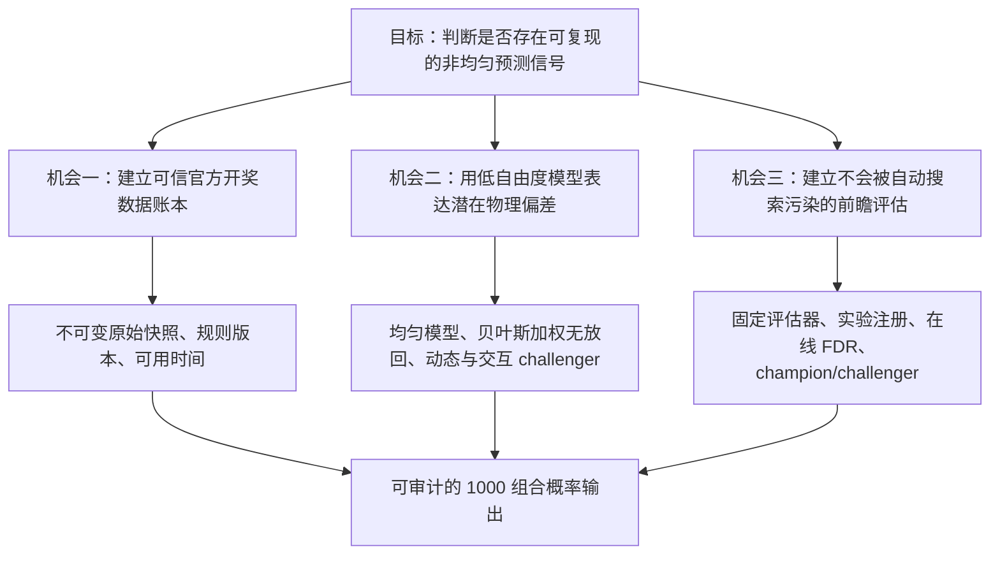
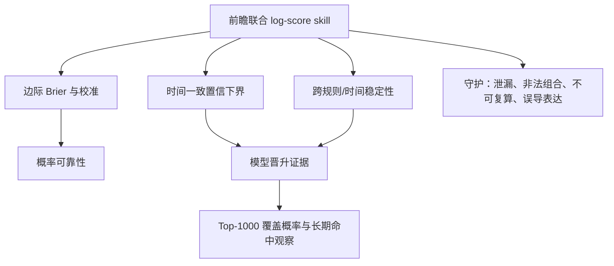

# 彩票概率建模与 Autoresearch 系统技术研究报告

## 修订记录

| 版本 | 日期 | 修订者 | 修订说明 | 依据 |
| --- | --- | --- | --- | --- |
| v1.0 | 2026-07-31 | Codex | 建立模型、数据集、特征、评估及 autoresearch 完整研究方案 | [SOURCE-01] [SOURCE-02] [SOURCE-03] |
| v1.1 | 2026-07-31 | Codex | 修正数据源独立性、时间语义、规则版本轴、短期可行性与长期稳定性边界，并建立阶段 0 证据合同 | [DATA-01] [DATA-02] [TECH-01] |
| v1.2 | 2026-07-31 | Codex | 冻结阶段 0 验收边界，补齐 Schema、规范哈希、观察计划、修订门、独立重放和确定性项目决策 | [DATA-01] [DATA-02] [TECH-02] |
| v1.3 | 2026-08-01 | Codex | 分离复核人事前指派与事后签署；将官方主源可行性和第二渠道佐证置信度解耦，增加三档佐证层级 | [DATA-01] [DATA-02] [TECH-02] |

## 文档概览

| 项目 | 内容 |
| --- | --- |
| 研究目的 | 确定中国体彩超级大乐透与福彩双色球概率预测研究系统的科学问题、候选模型、数据契约、特征体系、评估门槛及 autoresearch 机制。[SOURCE-01] |
| 支持决策 | 决定哪些模型值得进入自动实验，哪些数据和特征可合法进入预测时点，以及模型晋升 champion 所需的证据。[SOURCE-01] |
| 产品范围 | 研究型概率预测、随机性审计、每期 1000 个候选组合及持续的前瞻评估；不包含代购、自动投注或中奖保证。[SOURCE-01] [LEGAL-01] |
| 目标读者 | 项目发起人、统计建模人员、数据工程与研究平台设计者。[SOURCE-01] |
| 时间范围 | 先验证事前冻结的目标/最低历史区间，再从系统启用日起持续累积前瞻预测账本；未通过区间不得声称全量。[DATA-01] [DATA-02] [TECH-02] |
| 研究状态 | 方案级 Ready；官方历史接口稳定性、摇奖机/球组元数据可得性仍需数据可行性验证。[DATA-01] [DATA-02] |

结论先行：系统应把“均匀、独立、无可利用历史信号”作为零假设和长期 champion。最优 challenger 不是神经网络，而是强收缩、分区建模、固定基数的贝叶斯加权无放回模型；只有该模型在严格的前瞻概率评分上击败均匀模型后，才扩展到动态权重和二阶交互模型。[TECH-01] [SOURCE-04] [SOURCE-05]

## 研究问题与决策背景

### 需要回答的研究问题

1. 官方开奖序列是否存在超出有限样本随机波动的、可重复且可前瞻利用的非均匀性或条件依赖？[SOURCE-04] [SOURCE-05]
2. 哪一种模型能在保持合法组合、联合概率归一化和可校准性的同时，以最少自由度表示潜在物理偏差？[TECH-01]
3. 哪些字段在预测截止时间之前真实可得，哪些字段只能用于开奖后解释，如何防止“发布时间晚于预测时间”的隐性泄漏？[DATA-01] [DATA-02]
4. 如何让自动研究系统不断提出和淘汰实验，同时不因反复查看同一验证集而制造虚假优势？[SOURCE-07] [SOURCE-08] [SOURCE-09]
5. 1000 个候选组合应如何生成、排序和披露概率，尤其是在所有组合仍被认为等概率时？[SOURCE-02] [SOURCE-03]

### 游戏状态空间

官方规则规定，双色球由 33 个红球中选择 6 个、16 个蓝球中选择 1 个；大乐透由 35 个前区号码中选择 5 个、12 个后区号码中选择 2 个，均为区内不重复且组合内顺序无关。[SOURCE-02] [SOURCE-03]

$$
N_{SSQ}=\binom{33}{6}\binom{16}{1}=17,721,088
$$

$$
N_{DLT}=\binom{35}{5}\binom{12}{2}=21,425,712
$$

在均匀模型下，每期给出 1000 个互不重复组合，其完整开奖号码覆盖率分别为 $1000/N_{SSQ}=0.00564\%$ 和 $1000/N_{DLT}=0.00467\%$。这意味着即使历史回测覆盖数千期，完整 Top-1000 命中仍极度稀疏，不能承担高频模型选择功能；应使用严格适当的概率评分评价每期完整预测分布。[SOURCE-06]

### 可证伪目标

系统目标定义为：在预测时点可得的信息集合 $\mathcal{F}_{t-1}$ 下，估计下一期合法组合的联合概率 $p(Y_t\mid\mathcal{F}_{t-1})$；通过前瞻、按时间顺序的评分证明其是否优于均匀基线。系统不把“接近 100%”作为优化指标，因为若开奖近似独立均匀，任何历史模型的理论最优分布仍是均匀分布。[SOURCE-04] [SOURCE-05]

本研究把早期方案视为需要持续证伪的假设，而不是固定路线图；这与用实验获得验证学习的产品研究方法一致。[M-PR-04]

## 证据清单与可信度

| 标记 | 证据 | 类型 | 置信度 | 对方案的用途 |
| --- | --- | --- | --- | --- |
| [SOURCE-01] | 用户提出的双彩种、1000 组合及持续迭代目标 | 项目输入 | 高 | 确定产品边界与输出要求 |
| [SOURCE-02] | 中国福利彩票双色球游戏规则 | 官方规则 | 高 | 确定号码空间、开奖机制、时间和规则版本 |
| [SOURCE-03] | 中国体育彩票超级大乐透游戏规则 | 官方规则 | 高 | 确定号码空间、开奖机制、时间和规则版本 |
| [DATA-01] | 中国体彩网历史开奖与图表数据页面 | 官方数据入口 | 中 | 大乐透历史数据首选源；稳定接口仍需验证 |
| [DATA-02] | 中国福利彩票及省级福彩开奖公告入口 | 官方数据入口 | 中 | 双色球历史数据首选源；需双源核验和保存原始公告 |
| [SOURCE-04] | lotto k/N 统计审计研究 | 学术论文 | 高 | 给出超几何零假设、均值协方差与随机性审计框架 |
| [SOURCE-05] | NIST SP 800-22 | 官方技术标准 | 高 | 支持“统计测试只能发现异常，不能证明可预测”边界 |
| [SOURCE-06] | 严格适当概率评分研究 | 同行评审论文 | 高 | 选择联合 log score、Brier 与校准作为评估工具 |
| [SOURCE-07] | 预测分布 stacking 研究 | 同行评审论文 | 高 | 设计模型组合权重 |
| [SOURCE-08] | 在线 FDR 的 LORD/LOND 研究 | 学术论文 | 高 | 控制无限实验中的多重比较错误 |
| [SOURCE-09] | 回测过拟合研究 | 学术研究 | 中 | 约束反复搜索和验证集污染 |
| [SOURCE-10] | Karpathy autoresearch | 原始开源项目 | 高 | 提取固定评估器、固定预算、保留/淘汰循环模式 |
| [LEGAL-01] | 《彩票管理条例》及责任彩票要求 | 法规/官方说明 | 高 | 禁止误导宣传、未成年人使用和诱导性投注设计 |

证据缺口主要有两项：公开页面尚未确认是否稳定提供机器编号、球组编号、摇出顺序、设备维护和更换记录；如果这些字段不可得，系统就缺少最有机制解释力的物理特征，只能对历史号码做低功效统计审计。[DATA-01] [DATA-02]

## 用户与场景洞察

当前唯一经确认的使用场景是：研究者希望系统每期给出 1000 个概率候选，并在真实开奖后自动更新研究结论。[SOURCE-01] 尚无用户访谈或行为数据支持将其扩展为大众购彩产品，因此本阶段把产品定位为“研究与审计工具”，不推断用户付费意愿、购彩频率或风险偏好。[SOURCE-01]

| 场景 | 用户任务 | 系统输出 | 成功标准 | 证据 |
| --- | --- | --- | --- | --- |
| 开奖前 | 冻结下一期概率预测 | 模型版本、数据截止点、1000 个组合、逐组合概率、覆盖概率和哈希 | 输出在开奖前不可变且可复算 | [SOURCE-01] |
| 开奖后 | 评价上一期预测 | 联合 log score、边际 Brier、实际组合排名、Top-1000 命中状态 | 评分只读取已冻结预测 | [SOURCE-06] |
| 周期研究 | 比较候选模型和特征 | 时间滚动回测、前瞻证据、校准与错误率控制 | 不污染前瞻账本，不隐瞒失败实验 | [SOURCE-08] [SOURCE-09] |
| 随机性审计 | 判断开奖是否与理论分布相容 | 频数、协方差、间隔、运行、漂移及多重检验结果 | 只报告异常证据，不把未拒绝零假设写成“证明随机” | [SOURCE-04] [SOURCE-05] |

## 市场与竞品洞察

本项目不以“专家选号”或宣称高命中率的产品作为可信技术基准，因为此类展示通常缺少开奖前不可变预测、完整失败记录、概率归一化和前瞻检验。[SOURCE-06] [SOURCE-09] 可借鉴的技术参照是 autoresearch 的实验循环：固定数据准备和评估器，只允许候选研究代码变化，在固定预算下按指标保留或淘汰实验。[SOURCE-10]

原始 autoresearch 通过 Git 分支、固定时长实验和单一验证指标推进，但彩票场景不能直接照搬“验证指标一变好就保留”，因为开奖样本少、信号弱、连续实验会放大偶然改进。[SOURCE-08] [SOURCE-09] 因此本项目必须额外保存全部失败实验、使用时间滚动评估、设置前瞻晋升门槛，并对连续假设检验实施在线错误率控制。

## 问题机会与价值主张

项目真正的价值不是制造看似有规律的号码，而是把每个预测主张变成可复算、可否证、可统计审查的前瞻实验。[SOURCE-04] [SOURCE-06] 如果长期结论仍是均匀分布，系统也完成了有价值的研究结果：它量化了复杂模型没有创造预测信息，并阻止将回测噪声包装成优势。[SOURCE-09]

## 方案方向与优先级

### 一、数据集设计

采用事件时间与可用时间并存的分层数据集。所有预测特征必须满足 `available_at < prediction_locked_at`；仅有开奖日期但没有发布时间的字段不得自动视为开奖前可用。`draw_at`、`page_published_at`、`http_date`、`first_seen_at`、`retrieved_at`、`corrected_at` 和 `available_at` 必须分开保存，不能用 HTTP Date、开奖时间或首次发现时间冒充官方发布时间。[DATA-01] [DATA-02]

| 层级/表 | 主键 | 核心字段 | 不变量 | 用途 [TECH-01] |
| --- | --- | --- | --- | --- |
| `raw_source_snapshot` | `snapshot_id` | 请求/最终 URL、重定向链、`retrieved_at`、HTTP 状态、允许保留的响应元数据、原始载荷字节、字符集判定、SHA-256 | 原始载荷只追加不覆盖；解码与解析是独立派生步骤；不得保存 Cookie、鉴权信息等秘密 | 来源追溯与重新解析 [DATA-01] [DATA-02] |
| `number_space_version` | `game_id, effective_from_issue` | 分区、号码范围、选取数量、是否重复、结果是否有序、官方依据 | 每一期必须唯一映射 | 决定合法组合空间 [SOURCE-02] [SOURCE-03] |
| `draw_process_version` | `game_id, effective_from_issue` | 开奖日、停售时间、摇奖流程、结果发布流程、官方依据 | 与号码空间版本独立 | 识别时间或物理过程变化 [SOURCE-02] [SOURCE-03] |
| `prize_rule_version` | `game_id, effective_from_issue` | 奖级、奖金分配、固定/浮动奖、官方依据 | 奖级变化不得自动解释为号码概率变化 | 奖金解释与产品展示 [SOURCE-02] [SOURCE-03] |
| `active_promotion_ids` | `game_id, issue` | 当期零个或多个并行生效的派奖、特别规定和临时活动 ID | 允许重叠；不进入号码生成概率 | 活动和收益解释 [SOURCE-02] [SOURCE-03] |
| `draw` | `game_id, issue` | `draw_at`、开奖号码、公布顺序/实际摇出顺序标记、`page_published_at`、`first_seen_at`、销售额、奖池、状态 | 号码范围/数量合法、区内无重复；未知发布时间和摇出顺序保持空值 | 核心事实表 [SOURCE-02] [SOURCE-03] |
| `draw_number` | `game_id, issue, zone, number` | `draw_order`、`is_winner`、`available_at` | 每区命中数与规则一致 | 号码级训练与审计 [SOURCE-04] |
| `draw_revision` | `revision_id` | 原值、新值、来源、发现时间、原因 | 更正只追加并能重建任一历史视图 | 防止静默修数 [DATA-01] [DATA-02] |
| `mechanism_metadata` | `game_id, issue` | 摇奖机、球组、维护/更换、视频证据、提取置信度 | 未经官方证据不得填充 | 物理偏差模型；当前可得性待验证 [DATA-01] [DATA-02] |
| `feature_snapshot` | `game_id, target_issue, feature_set_version` | `as_of_issue`、特征列、代码哈希、输入快照哈希 | 只能读取目标期之前的数据 | 防止特征泄漏 [SOURCE-09] |
| `forecast` | `game_id, target_issue, model_version` | 完整模型参数、1000 组合、逐项概率、概率质量、锁定时间、签名 | 开奖前锁定，开奖后不可变 | 真正前瞻证据 [SOURCE-06] |
| `experiment` | `experiment_id` | 假设、父实验、数据哈希、代码提交、预算、指标、错误预算、结果 | 成功、失败、崩溃均保存 | autoresearch 记忆 [SOURCE-08] [SOURCE-10] |

数据质量门包括：事前冻结目标/最低区间和核对样本、期号唯一、号码区间、区内不重复、选取数量、开奖日期与规则日历、预期期号集合与实际集合对账、三个单值规则轴与 `active_promotion_ids` 映射、权威主发布源、官方核对渠道可用性与佐证层级、原始载荷哈希、解析器产物哈希、RFC 8785 规范记录哈希、人工核心号码改写次数为零和追加式更正链完整性。所有机器产物必须先通过冻结的 JSON Schema 2020-12；佐证层级分为 `corroborated_official`、`shared_upstream` 和 `primary_only`。第二官方渠道不可用会降低佐证置信度，但不会单独否定权威主源的数据可行性；多个官方渠道共享上游时，渠道一致只能用于核验采集和解析，不能表述为两个独立真值。[SOURCE-02] [SOURCE-03] [DATA-01] [DATA-02] [TECH-02]

数据分区不能随机打乱。历史数据按时间形成开发期、内部选择期和一次性历史审计期；系统启动后建立真正的前瞻影子期。开发期可供 autoresearch 高频实验，内部选择期限制查询次数，历史审计期只在研究版本冻结时使用一次，前瞻影子期按期追加并永不回写。[SOURCE-09]

### 二、特征设计与抽取

特征按“机制可信度”分级，等级决定先验收缩强度和进入模型的优先级。

| 等级 | 特征族 | 示例 | 预测时点规则 | 建议用途 [TECH-01] |
| --- | --- | --- | --- | --- |
| A：机制型 | 摇奖设备与球组 | 机器 ID、球组 ID、球组累计使用次数、维护/更换、摇出顺序 | 只有官方且在开奖前可知时可用 | 最高优先 challenger；当前数据可得性待验证 [DATA-01] [DATA-02] |
| B：规则与制度型 | 规则/流程状态 | 规则版本、休市恢复、开奖日、设备制度变更 | 规则在目标期前已生效 | 分段、漂移检测和交互控制 [SOURCE-02] [SOURCE-03] |
| C：历史边际型 | 单号码过去表现 | expanding count；20/50/100/250 期 rolling count；EWMA；距上次出现期数；经验 hazard | 全部窗口截止 `t-1` | 低自由度偏差检测，不默认解释为热冷趋势 [SOURCE-04] |
| D：历史依赖型 | 跨期/区内关系 | 与上期重复数、号码对共现、lag-1/2/3 inclusion、区间协方差、前后区依赖 | 只用过去开奖号 | 二阶模型候选，必须强收缩 [SOURCE-04] |
| E：集合形态型 | 候选组合属性 | 和值、跨度、奇偶数、大小比、连续对、尾数重复、模类计数 | 从候选组合本身计算 | 诊断和最大熵交互；不得凭历史图形直接硬筛 [TECH-01] |
| F：开奖后字段 | 销售与奖金 | 当期最终销售额、中奖注数、奖池变化、媒体解释 | 若官方在锁定后发布则不可预测当期 | 结果分析，不进入当期特征 [DATA-01] [DATA-02] |
| N：负控特征 | 无因果预期的模式 | 星座、生肖、期号数字和、随机噪声列 | 明确标记负控 | 测量管线发现伪规律的倾向 [TECH-01] |

抽取契约要求每个特征声明：`feature_id`、数学定义、输入列、窗口、最早可用时间、缺失策略、适用规则版本、期望方向（允许未知）、泄漏测试和单元级不变量。任何特征的归一化、阈值或分箱都必须只在训练窗口拟合，再应用于后续窗口。[SOURCE-09]

“遗漏值越大越容易回补”“近期热号会延续”不能被编码成固定方向权重。它们应分别作为两组互相竞争的参数化假设，和零权重共同接受时间外评分；否则会把赌徒谬误直接写入系统。[SOURCE-04]

### 三、模型选择

模型必须输出合法组合上的联合概率，而不只是对每个号码独立分类。独立 sigmoid 会给非法基数分配概率，也不能直接形成归一化的组合排名，因此只能作为诊断 challenger，不作为最终概率层。[TECH-01]

| 模型 | 联合概率合法性 | 样本效率 | 可解释性 | 主要风险 | 决策 |
| --- | --- | --- | --- | --- | --- |
| M0 均匀无放回 | 精确 | 最高 | 最高 | 无法表达真实设备偏差 | 初始及默认 champion [SOURCE-02] [SOURCE-03] |
| M1 静态贝叶斯加权子集 | 精确、区内固定基数 | 高 | 高 | 将随机频数差误作固定偏差 | 第一 challenger [TECH-01] |
| M2 动态状态空间加权子集 | 精确 | 中 | 高 | 自由度增加、把噪声解释成漂移 | M1 前瞻胜出后才开放 [TECH-01] |
| M3 固定基数最大熵/二阶交互 | 精确但计算更重 | 低至中 | 中 | 号码对参数多、过拟合严重 | 只验证少量预注册交互 [SOURCE-09] |
| M4 GBDT/正则逻辑回归边际模型 | 需后接固定基数投影 | 中 | 中 | 边际改善未必转化为联合改善 | 诊断 challenger [TECH-01] |
| M5 热冷号、遗漏、Markov 启发式 | 可归一化 | 表面较高 | 高 | 赌徒谬误与回测选择偏差 | 作为负控与复现实验，不晋升 [SOURCE-04] |
| M6 LSTM/Transformer/RL | 需复杂解码 | 低 | 低 | 历史期数相对参数量过少且无机制特征 | 当前阶段拒绝 [SOURCE-09] |
| M7 文献中的专用彩票模型 | 视模型而定 | 未知 | 不一 | 论文内优势可能不可复现或非前瞻 | 仅在统一 harness 下复现后评审 |

推荐的 M1 对每个号码设对数权重 $\theta_i$。对于从 $N$ 个号码中选取固定 $k$ 个的无序子集 $S$：

$$
p(S\mid\theta)=\frac{\exp(\sum_{i\in S}\theta_i)}{\sum_{|A|=k}\exp(\sum_{j\in A}\theta_j)}
$$

当所有 $\theta_i=0$ 时严格退化为均匀模型。对 $\theta$ 使用以 0 为中心的层次先验，使有限样本频数差被收缩回均匀；双色球红/蓝、大乐透前/后区分别建模，只有跨区依赖通过前瞻证据后才增加交互。[TECH-01] 加权无放回抽样是表达潜在选择偏差的标准问题族，且相比直接给两千万个组合估参，自由度大幅降低。[SOURCE-11]

M2 使用 $\theta_{i,t}=\rho\theta_{i,t-1}+\epsilon_{i,t}$ 表示缓慢变化；$\rho$、过程噪声和时间衰减不能由同一个最终验证窗口调优。若设备和球组元数据可得，优先加入分层随机效应，而不是先扩大号码历史窗口。[DATA-01] [DATA-02]

M3 只对预注册的低维结构加入 $\theta_{ij}$，例如同一物理球组或明确的集合属性。全量号码对会迅速产生数百参数，在现有开奖期数下应默认关闭。[SOURCE-09]

### 四、模型权重与 1000 组合生成

候选模型先独立产生完整概率分布，再用预测分布 stacking 得到：

$$
p_{ens}(S)=\sum_{m=0}^{M} w_m p_m(S),\quad w_m\ge0,\quad \sum_m w_m=1
$$

权重通过内部时间滚动预测的平均 log score 学习，并加入朝均匀模型权重收缩的约束。预测 stacking 的理论用途是直接组合预测分布，而不是平均参数或平均号码分数。[SOURCE-07] 在 challenger 未通过晋升门槛前，对外 champion 输出仍由 M0 决定，不能用开发集上的微小优势改变公开概率。

两彩种完整组合空间约 1772 万和 2143 万，研究版可以分块穷举并维护大小为 1000 的最小堆，得到精确 Top-1000；对 M0，所有组合同概率，系统用可审计的加密安全随机种子无放回抽取 1000 个，并明确标记为“并列概率”，不得伪造排名。[SOURCE-02] [SOURCE-03]

输出记录必须包含：目标期号、数据截止期、模型与特征版本、每个组合的联合概率、1000 组合总覆盖概率、与均匀概率比、生成种子、锁定时间、文件哈希，以及“该概率是模型估计而非中奖保证”的说明。[LEGAL-01]

### 五、评估体系与模型晋升

联合 log score 是主指标：

$$
LS_t(M)=-\log p_M(Y_t\mid\mathcal{F}_{t-1})
$$

相对均匀模型的单期技能为 $\Delta_t=LS_t(M0)-LS_t(M)$；正值代表 challenger 给实际结果更高概率。Log score 是严格适当评分，可阻止模型通过虚报过高置信度获得长期优势。[SOURCE-06]

| 类别 | 指标 | 角色 | 说明 |
| --- | --- | --- | --- |
| 主指标 | 平均联合 log-score skill | 自动研究优化目标 | 与均匀模型逐期配对比较 [SOURCE-06] |
| 主门槛 | $\Delta_t$ 的时间一致置信下界 | champion 晋升 | 必须在前瞻期大于 0；具体样本量由目标效应功效分析确定 [SOURCE-08] |
| 辅指标 | 号码 inclusion Brier | 快速诊断 | 分区计算，观察边际概率校准 [SOURCE-06] |
| 辅指标 | 校准曲线与可靠性分解 | 概率质量 | 防止只提高 sharpness 却失去 calibration [SOURCE-06] |
| 业务观察 | Top-1000 全中、实际组合排名、覆盖概率 | 长期展示 | 因事件极稀疏，不用于高频实验选择 [SOURCE-02] [SOURCE-03] |
| 随机性审计 | 边际频数、协方差、间隔、游程、自相关、跨区独立、滚动漂移 | 发现异常 | 采用精确/参数自助或置换零分布并校正多重检验 [SOURCE-04] [SOURCE-05] |
| 守护指标 | 非法组合率、概率和误差、数据延迟、预测锁定失败、复算差异 | 系统可信度 | 任一关键守护失败即禁止发布概率 [TECH-01] |

模型晋升必须同时满足：前瞻主指标改善的时间一致置信下界大于 0；在线多重检验错误率在预定水平内；边际校准不显著恶化；优势不由单一期、单一规则版本或数据修订驱动；全部实验与失败记录可追溯；没有预测时点泄漏。[SOURCE-08] [SOURCE-09]

历史回测只能筛除明显无效方案，不能直接授予 champion。真正晋升证据来自系统启用后、每期提前锁定的预测账本。[SOURCE-09]

### 六、Autoresearch 系统方案

彩票 autoresearch 采用“双循环”：开奖周期循环负责形成真实前瞻证据；离线研究循环负责在固定历史开发数据上提出和淘汰候选。两者共享实验注册表，但离线循环不能改写已锁定预测或前瞻评分。[SOURCE-10]

与原始 autoresearch 相同，数据准备与评估器必须是只读可信基座，研究代理只能修改候选模型、允许的特征配置和训练参数；每次实验有固定计算预算和超时规则。[SOURCE-10] 与原始方案不同，本系统不删除失败提交：每个实验保留补丁、父实验、假设、日志、随机种子、资源消耗和完整指标，便于识别重复失败和研究路径依赖。

每个实验必须先注册以下合同：

| 字段 | 内容 | 目的 |
| --- | --- | --- |
| `hypothesis` | 一句可证伪假设及预期影响的指标 | 防止无目的调参 |
| `change_scope` | 一次只改一个模型、特征族或训练因素；组合实验需声明依据 | 保持归因清晰 [SOURCE-10] |
| `dataset_manifest` | 原始快照、规则、分区和特征快照哈希 | 保证可复算 [SOURCE-09] |
| `evaluation_plan` | 时间折、主指标、辅指标、守护指标、停止条件 | 防止看到结果后改口径 [SOURCE-09] |
| `error_budget` | 所属假设族、在线检验序号和可用 alpha wealth | 控制无限研究的假阳性 [SOURCE-08] |
| `resource_budget` | CPU/GPU、内存、墙钟时间和最大重试 | 保证公平比较 [SOURCE-10] |
| `lineage` | 父实验、代码提交、环境锁文件和随机种子 | 保存研究谱系 [SOURCE-10] |
| `decision` | reject、archive、shadow、promote-candidate 或 crash | 显式记录失败 [SOURCE-10] |

研究代理的搜索顺序固定为：数据与泄漏负控 → M0 复算 → M1 先验/窗口 → 机制元数据 → M2 动态性 → 少量 M3 交互 → M4 黑盒诊断。未经前一层证据不得跳到深度模型，以减少组合搜索造成的选择偏差。[SOURCE-09]

离线保留规则不是简单的“分数更好即 keep”。实验首先要通过数据完整、概率归一、确定性复算和泄漏测试；再比较所有时间折的 paired log score；最后扣除该假设族已消耗的错误预算。仅历史表现改善的实验进入 shadow 队列，不直接替换 champion。[SOURCE-08] [SOURCE-09]

前瞻 challenger 每期与 champion 同时锁定但不影响公开输出。模型权重可使用预测 stacking 作为研究结果，但晋升判断仍以预注册的逐期分数差和时间一致证据为准。[SOURCE-07] [SOURCE-08]

### 七、研究阶段与决策门

本阶段不进入产品实现，下一步仍是研究验证。建议按以下阶段完成证据闭环：

| 阶段 | 研究产物 | 必须回答的问题 | 通过门槛 [TECH-01] |
| --- | --- | --- | --- |
| R0 数据源可行性 | 事前范围冻结、权威来源目录、Schema、原始载荷快照、字段/时间合同、三单值规则轴与活动集合、计划/实际请求对账、覆盖集合、修订链、证据清单、阶段 1 夹具和独立重放报告 | 能否在不绕过访问控制的前提下取得并证明核心开奖事实？冻结的目标或最低区间是否通过？发布时间、修订和机制元数据实际可得多少？ | P0-01 在观察来源结果前冻结区间、样本、预算、截止时间和复核人；全部 14 个硬门按彩种判定；独立复核人用唯一命令复算相同哈希和结论；短期观察只证明可行性，不宣称长期 SLO [DATA-01] [DATA-02] [TECH-02] |
| R1 数据集审计 | 规范化全量数据字典、质量报告、规则分段 | 实际历史覆盖、缺失、重复、规则变化如何？ | 所有期映射规则；异常均有来源证据 [SOURCE-02] [SOURCE-03] |
| R2 随机性研究 | 超几何零假设审计报告、模拟功效分析 | 有哪些偏差超过随机波动？检验对多小偏差有能力？ | 多重校正后报告；模拟验证 I 类错误 [SOURCE-04] [SOURCE-05] |
| R3 模型复现实验 | M0-M4 统一历史时间滚动比较 | 强收缩模型是否在多个时间折稳定优于 M0？ | 主指标、校准、负控和敏感性均完整 [SOURCE-06] [SOURCE-09] |
| R4 Autoresearch 仿真 | 在合成均匀和注入偏差数据上的系统研究 | 自动循环是否会在纯随机数据上虚假发现？能否找回已知弱偏差？ | 纯随机假阳性受控；注入偏差达到预定检出功效 [SOURCE-08] |
| R5 前瞻影子研究 | 每期不可变预测与累计证据 | 历史优势能否在真实未来开奖中持续？ | 由功效分析确定最小期数；在线证据通过才提出晋升 [SOURCE-08] |

R4 是整个系统的关键验收：先生成与两种彩票规则一致的均匀合成开奖，再注入已知静态球偏差、缓慢漂移、规则切换和数据泄漏陷阱。一个合格的 autoresearch 系统应在均匀世界里大多保留 M0，在偏差世界里按预定功效发现正确模型，并对泄漏特征明确失败。[SOURCE-04] [SOURCE-08]

## 指标体系与验证计划

北极星研究指标是“相对均匀基线的前瞻联合 log-score skill”，而不是中奖次数或历史拟合率；指标从研究目标向输入指标和守护指标展开。[SOURCE-06] [M-PR-08]

实验采用 expanding-window rolling origin。对目标期 $t$，训练、变换拟合、特征选择和权重学习都只能读取 $1\ldots t-1$；预测 $t$ 后再向前滚动。模型超参数选择需要嵌套在每个训练窗口内部，禁止用外层目标期调参。[SOURCE-09]

为了衡量 autoresearch 本身而非某一次模型，至少运行三类元实验：

1. 纯均匀合成数据：测量系统在无限尝试下错误发现“规律”的频率。[SOURCE-08]
2. 可控偏差合成数据：分别注入边际球权重、机器/球组效应、时间漂移和 pair interaction，绘制效应大小—样本量—检出率曲线。[SOURCE-04]
3. 泄漏对抗数据：故意加入开奖后销售额、未来滚动统计、全数据归一化和错误修订时间，要求管线在运行前阻断。[SOURCE-09]

## 风险边界与开放问题

| 风险/开放问题 | 影响 | 处理原则 | 依据 |
| --- | --- | --- | --- |
| 开奖设计接近真正随机 | 所有 challenger 长期不能优于 M0 | 接受 M0 为有效结论，不以模型复杂度代表进展 | [SOURCE-04] [SOURCE-05] |
| 历史样本相对状态空间极少 | 高容量模型能记忆噪声 | 强收缩、低维模型、合成检验和前瞻账本 | [SOURCE-09] |
| 反复搜索同一验证集 | 偶然最佳结果被当成发现 | 分层数据访问、实验注册、在线 FDR、一次性审计集 | [SOURCE-08] [SOURCE-09] |
| 官方页面结构、编码、动态加载或历史记录修订 | 数据不可复算、乱码、OCR 误判或静默变化 | 保存原始载荷、批准的响应元数据、输入/解析器/环境/规范输出哈希及追加状态事件；按 `supersedes` 确定性重建当前和历史视图；未经核对的 OCR 不得成为真值 | [DATA-01] [DATA-02] [TECH-02] |
| 缺少机器/球组元数据 | 无法建立最可信的物理偏差特征 | 将数据可得性作为 R0 首要问题，不用号码形态替代机制证据 | [DATA-01] [DATA-02] |
| Top-1000 命中太稀疏 | 无法用于模型快速选择 | 以严格适当概率评分为主，命中仅长期观察 | [SOURCE-02] [SOURCE-03] [SOURCE-06] |
| 概率输出被理解为中奖保证 | 误导用户并放大购彩风险 | 显示绝对概率、均匀基线、置信状态、理性提示；禁止自动购彩 | [LEGAL-01] |
| 规则变更 | 奖级或重叠活动可能被错误解释为号码生成过程变化 | 拆分 `number_space_version`、`draw_process_version`、`prize_rule_version` 三个单值轴和零到多个 `active_promotion_ids`；仅对有生成机制含义的变化分段 | [SOURCE-02] [SOURCE-03] |

仍需通过 R0 回答：官方公开渠道是否能够在不绕过访问控制的前提下机器读取；公开页面、机器接口和长期兼容性分别处于什么状态；事前冻结的目标区间或最低区间能否通过；历史开奖是否包含原始摇出顺序；摇奖机和球组信息能否从官方直播或公告可靠提取；三个单值规则轴、重叠活动集合和历史公告更正机制是什么。阶段 0 至少按事前计划观察每种彩票两个完整开奖周期并对账全部计划请求，这只是功能和恢复能力的冒烟证据，长期成功率与 SLO 必须在阶段 1 持续度量。[DATA-01] [DATA-02] [TECH-02]

## 研究材料清单

| 材料 | 当前状态 | 预期作用 | 证据 |
| --- | --- | --- | --- |
| 本技术研究报告 | 已完成 | 约束后续数据、模型和 autoresearch 研究 | [SOURCE-01] |
| 阶段 0 数据可行性计划及机器可读验收合同 v1.3 | 可开始 P0-01；P0-02 待范围冻结 | 统一冻结边界、Schema、证据链、复核指派/签署生命周期、佐证置信层级、规则/时间/修订模型、active/excluded 彩种范围与唯一 GO/LIMITED_GO/HOLD/STOP | [TECH-02] |
| 官方数据入口与字段可得性矩阵 | 待进入 R0 研究 | 确认真实数据边界 | [DATA-01] [DATA-02] |
| 游戏规则版本时间线 | 待进入 R0/R1 研究 | 分段并防止规则污染 | [SOURCE-02] [SOURCE-03] |
| 特征登记表与泄漏测试清单 | 方案已定义，待 R1 实证 | 约束特征抽取 | [SOURCE-09] |
| 合成数据偏差注入规格 | 方案已定义，待 R4 实证 | 验证 autoresearch 假阳性与功效 | [SOURCE-04] [SOURCE-08] |
| 前瞻预测登记协议 | 方案已定义，待 R5 启动 | 建立不可污染的真实证据 | [SOURCE-06] [SOURCE-09] |

## 参考文献

- [SOURCE-01] 用户需求，2026-07-31：大乐透与双色球每期输出 1000 个候选，并根据实际开奖持续迭代；本轮要求继续加强模型、数据、特征和 autoresearch 研究。
- [SOURCE-02] 四川省福利彩票发行中心（来源：中国福彩网），[《双色球游戏规则》](https://www.scflcp.com.cn/yxgz/823145252.jhtml)，访问于 2026-07-31。
- [SOURCE-03] 中国体育彩票，[《超级大乐透游戏规则》](https://m.lottery.gov.cn/ksjz/m/yxgz_dlt/)，访问于 2026-07-31。
- [DATA-01] 中国体育彩票，[超级大乐透历史开奖号码](https://m.lottery.gov.cn/zst/dlt/?tt_force_outside=1) 与 [历史开奖信息](https://m.lottery.gov.cn/mkjqxc/?SHA=false)，访问于 2026-07-31。
- [DATA-02] 上海市福利彩票发行中心，[双色球开奖公告入口](https://www.swlc.net.cn/shsflcpfxzx/lottery/ssq.html?view=check)；中国福利彩票发行管理中心，[官方网站](https://www.cwl.gov.cn/)，访问于 2026-07-31。
- [SOURCE-04] Coronel-Brizio, H. F. et al., [“Statistical auditing and randomness test of lotto k/N-type games”](https://arxiv.org/abs/0806.4595), 2008.
- [SOURCE-05] NIST, [SP 800-22 Rev. 1a: A Statistical Test Suite for Random and Pseudorandom Number Generators](https://csrc.nist.gov/pubs/sp/800/22/r1/upd1/final), 2010.
- [SOURCE-06] Gneiting, T. & Raftery, A. E., [“Strictly Proper Scoring Rules, Prediction, and Estimation”](https://sites.stat.washington.edu/people/raftery/Research/PDF/Gneiting2007jasa.pdf), Journal of the American Statistical Association, 2007；Gneiting, Balabdaoui & Raftery, [“Probabilistic forecasts, calibration and sharpness”](https://doi.org/10.1111/j.1467-9868.2007.00587.x), 2007.
- [SOURCE-07] Yao, Y., Vehtari, A., Simpson, D. & Gelman, A., [“Using Stacking to Average Bayesian Predictive Distributions”](https://doi.org/10.1214/17-BA1091), Bayesian Analysis, 2018.
- [SOURCE-08] Javanmard, A. & Montanari, A., [“On Online Control of False Discovery Rate”](https://arxiv.org/abs/1502.06197), 2015；Fisher, A., [“Online False Discovery Rate Control for LORD & SAFFRON Under Positive, Local Dependence”](https://arxiv.org/abs/2110.08161), 2021.
- [SOURCE-09] Bailey, D. H. et al., “The Probability of Backtest Overfitting,” Journal of Computational Finance, 2017；[概述与作者材料](https://escholarship.org/uc/item/9tq3327h)。
- [SOURCE-10] Karpathy, A., [autoresearch GitHub repository](https://github.com/karpathy/autoresearch) 及 [program.md](https://github.com/karpathy/autoresearch/blob/master/program.md)，访问于 2026-07-31。
- [SOURCE-11] Sampford, M. R., [“On sampling without replacement with unequal probabilities of selection”](https://doi.org/10.1093/biomet/54.3-4.499), Biometrika, 1967；Yu, Y., [“On the inclusion probabilities in some unequal probability sampling plans without replacement”](https://arxiv.org/abs/1005.4107), 2010.
- [TECH-01] 本报告的技术推导：固定基数指数族子集概率、分区联合建模、层次收缩、动态参数及 ensemble 设计；其适用性需通过 R3/R4/R5 的统一 harness 实证验证。
- [TECH-02] 项目内阶段 0 合同：[数据可行性验证计划](../roadmap/phase-0-data-feasibility-plan.md)与[机器可读验收合同](../roadmap/phase-0-acceptance-contract.json)，2026-07-31。
- [LEGAL-01] 国务院，[《彩票管理条例》](https://www.samr.gov.cn/zw/zfxxgk/fdzdgknr/bgt/art/2023/art_a76abb6a4f7445f883f7d2da0d52607d.html)；国家体育总局体育彩票管理中心，[理性购彩“五知道”](https://www.sport.gov.cn/n20001280/n20067608/n20067637/c24321299/content.html)，访问于 2026-07-31。
- [M-PR-04] Steve Blank, [“Why the Lean Start-Up Changes Everything”](https://hbr.org/2013/05/why-the-lean-start-up-changes-everything), Harvard Business Review, 2013；用于研究假设与验证学习的方法选择。
- [M-PR-08] Google Research, [“Measuring the User Experience on a Large Scale: User-Centered Metrics for Web Applications”](https://research.google/pubs/measuring-the-user-experience-on-a-large-scale-user-centered-metrics-for-web-applications/), 2010；用于目标到指标及守护指标的结构化映射。
