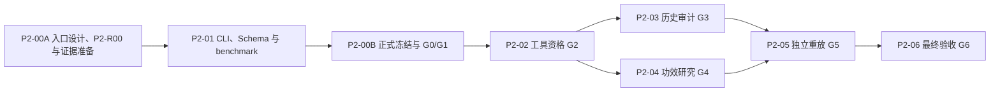

# 阶段 2：随机性审计与统计功效边界总体方案

版本：1.3  
状态：计划已修订；允许启动 P2-00A 入口准备，P2-01 须在 P2-R00 机器验收为 `P2-00A-READY` 后启动；正式统计运行须等待 P2-00B 完成且 G0、G1、G2 全部通过  
上游正式证据：Phase 1 contract 3.6.0 与 `phase1-acceptance.json`

## 0. 权威顺序与计划状态

阶段 2 出现冲突时按以下顺序解释：

1. `docs/roadmap/phase-2-acceptance-contract.json` 的机器约束；
2. 本总体方案；
3. Phase 1 contract 3.6.0、最终验收报告和冻结数据证据；
4. `docs/research/lottery-autoresearch-technical-strategy.md` 的 R2 研究目标；
5. 旧 `tasks/research/.../research-planning.json` 只作为历史任务分解参考。

旧 research roadmap 的状态和 Phase 0 handoff 路径没有随实际 Phase 1 实施更新，因此不得作为 Phase 2 的运行输入。本计划不删除或重写该历史 roadmap，而是在 P2-00A 生成显式桥接证据。当前状态是：P2-00A 可以启动；P2-00A 只形成证据、固定路径草案和非 D2 的 P2-R00 readiness 制品，P2-01 在 P2-R00 机器验收后形成正式 Phase 2 Schema/CLI，P2-00B 才冻结正式入口并验收 G0/G1；G2 通过前，历史统计审计和功效仿真保持 HOLD。

## 1. 一句话目标

用阶段 1 已验收的开奖数据和可复现仿真，回答两件事：现有样本能识别多大的非随机偏差，以及哪些看起来像规律的现象其实没有足够证据。

阶段 2 的成功标准是研究方法可信、误报受控、功效边界明确、结果可独立复算；不是必须发现可预测规律。

## 2. 为什么先做这一阶段

阶段 1 证明了数据可以被规范、重复地交付，但没有证明开奖存在可利用信号。当前每个彩种只有 200 个独立开奖样本，双色球和大乐透的组合空间都远大于样本量。如果直接进行大规模模型和特征搜索，很容易把随机波动当成优势。

阶段 2 在模型研究前建立统计护栏：先测量检验系统在纯随机世界中的误报率，再测量它对已知弱偏差的检出率，最后才能判断后续模型研究能提出多强的主张。

## 3. 阶段目标

阶段 2 必须完成以下目标：

1. 冻结双色球和大乐透各自的均匀、固定基数、无放回零假设。
2. 冻结检验族、显著性水平、多重性范围、逐效应参数的实际意义阈值登记表、随机种子规则和计算预算。
3. 对历史数据进行分彩种、分规则段的随机性审计。
4. 在纯随机合成数据中估计检验系统的误报率及 Monte Carlo 区间。
5. 在静态边际偏差、缓慢漂移、对子交互和合成机制偏差中估计检出率。
6. 给出每个偏差族/效应参数的最小可检测效应 `delta-star`、达到目标功效的最小所需期数或网格内不可识别状态，以及当前样本位置。
7. 由未编写主分析代码的独立复核人使用不同随机种子重放关键结果。
8. 把统计结论分成 `candidate_signal`、`no_detectable_signal` 和 `indeterminate`，不得把“不拒绝零假设”写成“证明绝对随机”。

## 4. 阶段责任

| 角色 | 主要责任 | 无权执行的动作 |
| --- | --- | --- |
| 阶段决策人 | 批准范围、预算、GO/HOLD/STOP；处理需要业务判断的例外 | 不得在看到结果后降低阈值 |
| 数据保管人 | 生成 Phase 2 输入 manifest；核对 Phase 1 哈希、彩种范围和规则映射 | 不得选择统计检验或解释显著性 |
| 统计研究负责人 | 编写预注册、主分析和功效研究；交付完整失败与不确定结果 | 不得批准自己的方法或删除不利场景 |
| 研究工具实现者 | 实现离线 CLI、仿真器、验证器和确定性测试 | 不得修改冻结数据、阈值或预注册 |
| 独立方法复核人 | 在结果运行前审查零假设、检验族、多重校正、效应参数和预算 | 不得参与主统计方案的结果选择 |
| 独立重放复核人 | 使用不同随机种子重算误报率、功效和 delta-star | 不得修改主报告或用相同随机流冒充独立复算 |
| 最终验收人 | 按机器合同核对全部门、证据和边界并签署最终结论 | 不得兼任统计研究负责人或工具实现者 |

一个自然人可以承担多个非冲突角色，但统计研究负责人/工具实现者与独立方法复核人、独立重放复核人、最终验收人必须保持身份独立。使用子 Agent 时，最低可接受的是“程序化独立”：独立 task/agent ID、未参与被审对象创作、只读冻结输入、独立 seed set、只写自己的 review/replay 制品，并登记 prompt/任务摘要哈希。程序化独立不得表述为组织或人工独立；如果使用不同自然人，则另标记 `organizational_independence`。同一代码的换人重跑只证明复现性；REP-02 的关键确定性统计量还必须由独立参考计算路径复算。

## 5. 工作边界

### 5.1 阶段内工作

- Phase 1 到 Phase 2 的证据交接与输入冻结。
- 规则版本分段和数据用途声明。
- 统计检验预注册。
- 离线随机性审计与 Monte Carlo 功效研究工具。
- 历史结果审计、合成偏差注入、误报和功效估计。
- 独立重放、研究报告与最终验收。

### 5.2 明确不做

- 不训练、选择或晋升预测模型。
- 不设计或筛选预测特征。
- 不输出每期 Top-1000 号码。
- 不把 800 条来源观测当作 800 个独立开奖样本；统计样本量只能按 400 个 DrawRecord 计算，且两个彩种不得合并增大功效。
- 不使用当期销售额、奖金、媒体解释或其他开奖后字段作为预测证据。
- 不补写不存在的原始摇出顺序；当前排序号码只能用于集合或次序统计量分析，不能解释为物理摇出位置。
- 不把合成机制偏差的可检出性写成真实机器或球组存在偏差。
- 不执行购彩、自动投注、收益测算或“概率逼近 100%”承诺。
- 不做 WebUI、在线 API、调度平台、数据库服务或长期生产部署。
- 不生成或依赖 spec-executor、通用 research harness 任务包；阶段 2 直接按本项目的 roadmap、机器合同和验收门执行。

## 6. 硬约束

1. **冻结输入。** 正式运行只能读取 G0 签名的 Phase 2 输入 manifest；运行期间 current release 或 live 数据变化不得进入本次研究。
2. **逐彩种研究。** 双色球和大乐透分别定义零假设、检验、功效与结论；不得合并样本。
3. **逐规则段研究。** 所有期号必须映射到唯一 `number_space_version` 和公开可证明的 `documented_draw_process_version`。这里的开奖过程版本只表示规则/公告中可证明的程序，不得伪装成未知的具体摇奖机或球组身份；实际设备、球组等另用 `mechanism_metadata_status=known|unknown` 表达。`prize_rule_version` 与 `active_promotion_ids` 只作为审计上下文，除非存在生成机制证据，不得改变号码零假设或切分生成样本。
4. **预注册优先。** 检验族、alpha、多重性范围、逐效应参数实际意义阈值、效应×样本量网格、种子层级、Monte Carlo 停止规则和预算必须在首次历史审计结果生成前冻结并签名。
5. **统计门槛固定。** 全局 `alpha=0.05`；目标功效不低于 `0.80`；同时报告效应量、区间和多重校正后证据，禁止只报告 p 值。
6. **无泄漏。** 当前 400 条记录全部为 `retrospective_current_view` 且 `available_at_utc=null`，本阶段只把开奖号码作为历史结果标签；其他字段不得自动解释为开奖前特征。
7. **不选择性报告。** 注册场景、统计量和失败运行必须全部进入 manifest；不得删除不显著、方向相反或程序失败的结果。
8. **结果与验收解耦。** Phase 2 PASS 表示研究过程可信，不表示发现非随机性；科学结论另用 `signal_status` 表达。
9. **离线可复算。** 最终验收不得依赖外部网络；外部来源只在 G0 规则证据审查时使用，证据必须保存引用和摘要。
10. **不可变证据。** 每次正式运行保留配置、输入哈希、代码哈希、环境、种子、日志、结果和终态，失败也不得覆盖。
11. **环境隔离。** Phase 2 数值计算依赖使用独立、固定版本的 lock 文件；不得静默改变 Phase 1 数据 CLI 的依赖或验收环境。任何共享依赖修改都必须单独说明兼容性证据。

## 7. 阶段输入

### 7.1 已具备输入

| 输入 | 当前证据 | 状态 |
| --- | --- | --- |
| Phase 1 最终验收 | `artifacts/phase-1/acceptance/phase1-acceptance.json` | PASS |
| 标准化开奖 | `artifacts/phase-1/baseline-v1/draws.jsonl` | 400 条；DLT/SSQ 各 200 |
| 来源观测与血缘 | `artifacts/phase-1/baseline-v1/observations.jsonl` | 800 条；只作证据，不作独立开奖样本 |
| 发布 manifest | `artifacts/phase-1/baseline-v1/manifest.json` | 已签名 |
| 数据质量报告 | `artifacts/phase-1/baseline-v1/quality-report.json` | PASS |
| Schema 与规范 freeze | Phase 1 schema bundle 与 spec freeze | 已闭合 |

### 7.2 正式统计运行前必须补齐的五项入口工作

1. **上游权威入口对齐。** Phase 2 以 Phase 1 contract 3.6.0 和最终验收报告为唯一上游入口，不再引用不存在的旧 `stage1-handoff-fixture.json`。
2. **输入和规则分段冻结。** 生成逐彩种 input manifest；为每期映射号码空间、公开开奖过程、奖金规则三个单值轴与零到多个活动 ID，并另记机制元数据状态。无法证明号码空间/公开开奖过程时对应生成分析 HOLD；奖金/活动或物理设备未知只阻塞相关上下文/机制归因，不得扩大为无关分析的全阶段 HOLD。
3. **point-in-time 用途声明。** 明确 400 条 retrospective 数据只可用于结果审计；`available_at_utc=null` 的记录不得进入未来预测特征快照。
4. **统计预注册与预算冻结。** 冻结跨期联合零假设、检验族、alpha、多重校正、逐 `(game, generation_segment, bias_family, effect_parameter)` 实际意义阈值登记表、效应×样本量网格、种子、固定预算或 time-uniform Monte Carlo 方法、同时功效带、最大 CPU/内存/墙钟和超时处理。
5. **独立身份冻结。** 在结果运行前登记统计负责人、方法复核人、重放复核人和最终验收人，确认冲突角色未由同一主体承担，并记录程序化/组织独立等级、agent/task ID 或人员身份及被审对象创作历史。

五项工作先在 P2-00A 的固定草案路径形成，由 P2-R00 readiness Schema 与独立验证脚本检查并签署 `P2-00A-READY`；P2-01 只能在该终态成立后启动。P2-01 再实现正式 Phase 2 Schema/验证器，P2-00B 冻结正式 D2-01..D2-05 并由 G0/G1 验收。P2-00A 不得自称 G0/G1 PASS；任一正式入口项失败，P2-02 及其后的工作不得启动。

## 8. 交付形态

阶段 2 交付一个**离线命令行研究工具**，不是 WebUI 或在线服务。建议统一入口：

```text
python -m lottery_research.phase2 validate-input --contract docs/roadmap/phase-2-acceptance-contract.json
python -m lottery_research.phase2 qualify-harness --prereg artifacts/phase-2/contracts/preregistration.json
python -m lottery_research.phase2 audit --run-id <run-id>
python -m lottery_research.phase2 power --run-id <run-id>
python -m lottery_research.phase2 replay --run-id <run-id> --seed-set independent
python -m lottery_research.phase2 accept --contract docs/roadmap/phase-2-acceptance-contract.json --evidence-manifest artifacts/phase-2/contracts/final-evidence-manifest.json --output artifacts/phase-2/acceptance/phase2-acceptance.json
```

这些是阶段 2 的目标接口，不代表当前已经实现。CLI 必须返回稳定退出码并输出单个结构化 JSON 终态；详细日志和大结果保存为被哈希引用的文件。

`audit`、`power` 和 `replay` 的每次执行必须写入 `artifacts/phase-2/runs/<run-id>/`，固定路径的正式结果只是由 run manifest 签名的发布投影。最终 `accept` 不得自动选择“最新运行”，必须读取 `final-evidence-manifest.json` 中明确列出的 audit run、power run 和 replay run ID 及其哈希。

建议退出码：`0=PASS`、`2=研究或质量拒绝`、`3=运行环境失败`、`4=合同/配置无效`、`5=证据哈希或重放不一致`、`20=HOLD`。

### 8.1 P2-00A 前置机器交接 P2-R00

P2-R00 是 P2-00A 到 P2-01 的**前置 readiness 制品**，不是 D2 正式交付物，也不表示 G0/G1 已通过。它固定以下路径：

| 制品 | 固定路径 | 用途 |
| --- | --- | --- |
| readiness Schema | `schemas/phase2-readiness/p2-00a-readiness.schema.json` | 冻结 P2-R00 结构和必填字段；与 D2-06 的 `schemas/phase2/` 隔离 |
| readiness 验证器 | `scripts/validate_phase2_readiness.py` | 重算上游身份、草案哈希、规则覆盖和越界制品计数 |
| readiness 终态 | `artifacts/phase-2/readiness/p2-00a-readiness.json` | 唯一记录 `P2-00A-READY` 或 `HOLD` |
| 输入 manifest 草案 | `artifacts/phase-2/readiness/drafts/input-manifest.draft.json` | 绑定 Phase 1 身份、400 个统计单位和规则映射草案 |
| 规则与用途合同草案 | `artifacts/phase-2/readiness/drafts/input-rule-and-time-contract.draft.md` | 记录规则证据、时间语义和禁用字段 |
| 预注册草案 | `artifacts/phase-2/readiness/drafts/preregistration.draft.json` | 记录联合零假设、检验族、实际意义阈值 registry 和模拟设计草案 |
| 角色草案 | `artifacts/phase-2/readiness/drafts/reviewer-assignment.draft.json` | 记录候选角色、冲突和独立等级 |

P2-R00 必须至少记录：上述草案的路径与 SHA-256、Phase 1 contract/final/baseline/Schema freeze 的身份、R2 来源路径与哈希、400 期规则 join 计数、影响生成零假设的未闭合项、必填草案字段覆盖率、正式 D2 路径占用数、正式历史结果数、验证器身份、reviewer identity 和唯一终态。固定验收命令为：

```text
python scripts/validate_phase2_readiness.py --contract docs/roadmap/phase-2-acceptance-contract.json --readiness artifacts/phase-2/readiness/p2-00a-readiness.json
```

只有命令 exit 0、终态为 `P2-00A-READY`、上游哈希匹配率=100%、400 期生成规则映射草案覆盖率=100%、必填草案字段覆盖率=100%、影响生成零假设的未闭合项=0、正式 D2 路径占用数=0、正式历史结果数=0 时，P2-01 才允许启动。Schema/合同无效返回 4，哈希不一致返回 5，可恢复证据缺失返回 20；验证失败不得靠人工备注改写为 READY。

## 9. 阶段交付物

| ID | 交付物 | 目标路径 | 责任人 |
| --- | --- | --- | --- |
| D2-01 | Phase 2 输入、数据用途和规则分段合同 | `docs/research/phase-2-input-rule-and-time-contract.md` | 数据保管人 |
| D2-02 | 输入 manifest | `artifacts/phase-2/contracts/input-manifest.json` | 数据保管人 |
| D2-03 | 统计预注册 | `artifacts/phase-2/contracts/preregistration.json` | 统计研究负责人 |
| D2-04 | 角色与独立性登记 | `artifacts/phase-2/contracts/reviewer-assignment.json` | 阶段决策人 |
| D2-05 | 独立方法预审 | `artifacts/phase-2/reviews/method-review.json` | 独立方法复核人 |
| D2-06 | 离线研究 CLI、Schema 与环境锁 | `src/lottery_research/phase2/`、`schemas/phase2/`、`requirements/phase2.lock`、`artifacts/phase-2/contracts/environment-lock.json` | 研究工具实现者 |
| D2-07 | 工具测试与合成资格报告 | `tests/phase2/`、`artifacts/phase-2/qualification/harness-qualification.json` | 工具实现者/方法复核人 |
| D2-08 | 历史随机性审计结果 | `artifacts/phase-2/results/historical-audit.json` | 统计研究负责人 |
| D2-09 | 功效曲线与 delta-star 结果 | `artifacts/phase-2/results/power-envelope.json` | 统计研究负责人 |
| D2-10 | 独立重放报告 | `artifacts/phase-2/reviews/replay-review.json` | 独立重放复核人 |
| D2-11 | 随机性与功效研究报告 | `docs/research/phase-2-randomness-audit-power-envelope.md` | 统计研究负责人 |
| D2-12 | 最终证据选择清单 | `artifacts/phase-2/contracts/final-evidence-manifest.json` | 数据保管人/最终验收人 |
| D2-13 | 最终机器验收报告 | `artifacts/phase-2/acceptance/phase2-acceptance.json` | 最终验收人 |

大规模逐格 Monte Carlo 结果允许使用 JSONL 或 Parquet，但必须由 `power-envelope.json` 列出路径、行数、Schema 和 SHA-256；最终结论不得只存在于 notebook。Notebook 可以作为辅助证据，不能成为唯一执行入口。

### 9.1 交付物定义和逐项验收合同

“文件存在”不等于交付。每项交付物必须同时满足内容定义、量化标准、验收方法和证据闭包；任一项缺失，该交付物不得标记 PASS。

| ID | 交付物定义与最低内容 | 量化交付标准 | 验收方法与正式证据 |
| --- | --- | --- | --- |
| D2-01 | 冻结本阶段可用数据、统计单位、规则时间线、公开开奖过程语义、机制元数据状态、`retrospective/current-view/available_at` 用法和禁用字段的人类可读合同 | 必需章节/声明/证据 ID 覆盖率=100%；400/400 期均映射到唯一号码空间段和公开开奖过程段；物理设备/球组未知必须显式标记；未声明混段=0；泄漏字段=0；未闭合且影响生成零假设的问题=0 | 文档合同检查器验证必需章节、声明 ID 和引用闭包；逐期与 Phase 1 baseline、Schema freeze、D2-02 和规则证据交叉核对；奖金/活动变化不得自动切分生成样本；方法复核人签名，结论进入 D2-05 |
| D2-02 | 列出所有输入文件、SHA-256、行数、彩种计数、期号范围、规则段和上游合同身份的机器清单 | 输入哈希匹配率=100%；DrawRecord=400（DLT=200、SSQ=200）；SourceObservation=800 且样本膨胀=0；不安全路径或 `latest` 引用=0 | `validate-input` 重算哈希、计数、唯一键和投影闭包；输出签名的 validation result |
| D2-03 | 在查看正式历史结果前冻结跨期联合零假设、检验注册表、主/负控/敏感性标签、多重性、逐效应参数的 practical-effect registry、效应×样本量网格、固定预算或顺序有效方法、同时置信带、种子和资源上限 | 必填字段覆盖率=100%；所有候选资格效应参数的实际意义阈值登记覆盖率=100%；计划检验/场景/样本量网格覆盖率=100%；历史结果生成后的未授权变更=0 | P2-00B 先执行 JSON Schema、阈值 registry 完整性、签名时间和哈希先后关系检查；G3/G4 再与 D2-08/D2-09 registry 做双向集合差，不能用未来结果反向决定 G0 |
| D2-04 | 记录七类角色、人员身份、冲突声明、签名和职责范围 | 必需角色分配率=100%；禁止角色冲突=0；缺失签名=0 | 机器冲突检查加最终验收人复核；结果哈希写入 D2-12 |
| D2-05 | 对 D2-01/D2-03 的零假设、统计量、多重性、practical-effect registry、效应×样本量网格、模拟预算和停止规则做独立预审 | 注册检验与效应参数复核覆盖率=100%；blocking findings=0；未处置非阻断意见=0 | 独立方法复核人逐项 verdict；其身份必须通过 D2-04 冲突检查 |
| D2-06 | 可离线运行的 Phase 2 CLI、结果 Schema、环境锁和稳定退出码实现 | 6 个合同命令可调用；合同/Schema 测试通过率=100%；非法参数组合接受数=0；Phase 1 依赖静默变化=0 | 离线 CLI 合同测试、错误路径测试、环境重建和依赖差异检查；证据由测试清单和 environment lock 承载 |
| D2-07 | 已知答案小世界、均匀世界、预声明强正例、负控、泄漏/篡改/混段和恢复测试及资格报告 | 精确空间概率归一误差≤`1e-12`；同种子规范化制品哈希一致率=100%；非法组合=0；泄漏/篡改漏检=0；95% 区间覆盖率单侧 95% 下界≥0.93；所有 `qualification_positive=true` 场景按预期方向恢复率=100% | 精确枚举对照、固定种子重算、故障注入和 Monte Carlo 校准；D2-07 汇总每个测试 ID、期望、状态和证据哈希 |
| D2-08 | 按彩种和规则段给出全部预注册历史检验的统计量、效应量、95% 区间、校正后证据和限制 | 注册结果覆盖率=100%；无理由缺失=0；DLT/SSQ 合并分析=0；探索性结果混入主结果=0；失败试验删除=0 | 将 D2-03 registry 与结果逐项反连接；Schema 校验；复算确定性统计量；G3 reviewer 签署 |
| D2-09 | 给出各偏差族/效应参数在效应×实际分段样本量网格上的 FWER、功效、有效 Monte Carlo 区间、同时功效带、`delta-star`、达到目标功效的最小所需期数或对应不可识别状态 | 零效应 FWER 单侧 95% 上界≤0.06；关键 FWER 区间半宽≤0.005；关键同时功效区间半宽≤0.03；每个注册偏差族/效应参数的功效与所需期数结果覆盖率=100%；超出 Monte Carlo 不确定性的反向功效跳变=0 | 固定预算或 time-uniform 顺序方法、效应×样本量网格同时置信带、独立种子复算、required-n 双向覆盖、完整性和单调性诊断；明细由 D2-09 以路径、行数、Schema、哈希引用 |
| D2-10 | 程序化或组织独立人员执行同代码复现、独立参考统计量复算和独立种子 Monte Carlo 重放 | 同代码同种子制品哈希一致率=100%；关键确定性统计量独立参考路径一致率=100%；不同种子估计均落在预注册联合容差内；双方识别时 `delta-star`/`required-n` 差≤对应 1 个网格步长、双方未识别时兼容、状态不一致时 HOLD；blocking findings=0 | `replay` 离线运行加独立参考计算；逐项差异报告、independence level 和 reviewer attestation；不得由主研究负责人或工具实现者签署 |
| D2-11 | 同时说明方法、输入限制、历史审计、误报、功效边界、信号分级和可/不可支持结论的研究报告 | 主结论证据链接覆盖率=100%；禁止性预测/中奖/随机性证明表述=0；两彩种合并结论=0；限制遗漏=0 | 报告引用闭包、禁语扫描和独立人工复核；每个结论 ID 回链 D2-08/D2-09/D2-10 |
| D2-12 | 唯一指定正式 audit/power/replay run ID、输入、代码、环境、结果路径和 SHA-256 的最终证据选择清单 | 正式证据引用闭包=100%；`latest`/通配符/隐式目录选择=0；重复 run ID 冲突=0；缺失哈希=0 | 清单 Schema 校验、全文件重哈希和 run manifest 反向核对；`accept` 只能读取此清单 |
| D2-13 | 对 D2-01..D2-12、G0..G6、全部必需 E2E、交付状态和科学信号状态作机器可读终局判定 | `accept` 前 D2-01..D2-12 证据哈希闭包=100%；10/10 E2E 达到各自预期终态；成功后 D2-01..D2-13 存在率=100%；blocking findings=0；未解释缺失结果=0 | 用固定 `accept` 命令离线验收，原子写入唯一约定路径并返回 exit 0；D2-13 不要求在自身内容中记录自身哈希；独立最终验收人签署 |

### 9.2 不可补偿原则

本阶段不采用加权总分。哈希错误不能用更高功效抵消，角色冲突不能用完整报告抵消，误报失控也不能用发现“显著规律”抵消。以下任一项不满足，阶段不得 PASS：输入真实性、预注册完整性、Monte Carlo 有效性、FWER 上界、已知正例恢复、研究工具资格、功效精度、独立重放、必需 E2E、交付覆盖率和 blocking findings 清零。

## 10. 研究方法

### 10.1 零假设

每个彩种、每个有效规则段、每个号码分区独立定义固定基数无放回均匀抽样：

- 双色球红球：从 1..33 中无放回选 6；蓝球：从 1..16 中选 1。
- 大乐透前区：从 1..35 中无放回选 5；后区：从 1..12 中无放回选 2。

联合零假设必须同时包含以下四层，缺一不可：

1. **单期分区内：** 按上述固定基数无放回均匀抽样。
2. **单期跨分区：** 在同一期、同一公开规则段条件下，各号码分区独立；只有预注册的跨区检验可以审计该假设。
3. **跨期开奖：** 在同一彩种、同一 `number_space_version` 和 `documented_draw_process_version` 条件下，各期开奖号码条件独立。该独立性是审计零假设，不是由历史数据证明的物理事实。
4. **日历与分段：** 合成零世界保留真实期号、开奖日历、缺期和规则段成员关系，只重新生成号码；不得把未观察期补成开奖，也不得跨生成规则段交换数据。

当前数据没有原始摇出顺序，因此不得建立物理抽取顺序模型。设备、球组等机制元数据未知时，边际/集合/时间一致性审计仍可执行，但机制归因分析必须标记 `indeterminate`，不得用号码形态代替机制证据。

### 10.2 主检验族

1. **边际包含频率族：** 每个号码在集合中出现次数及全局偏离统计量。
2. **集合结构族：** 排序后间隔、奇偶/区间等预注册聚合统计量；不得事后增加“看起来有趣”的分箱。
3. **对子与依赖族：** 号码对共同出现的全局统计量和少量预注册摘要，避免逐对无约束搜索。
4. **时间稳定性族：** 预注册窗口或变化点统计量，用于静态偏差与缓慢漂移区分。
5. **跨分区依赖族：** 前/后区或红/蓝区的预注册联合统计量。
6. **负控族：** 与生成机制无因果预期的期号数字、随机噪声标签等，只用于测量分析管线产生伪规律的倾向。

任何未注册的探索性分析必须单独标记 `exploratory`，不得进入主结论或 Phase 3 的模型开放门。

### 10.3 多重性和区间

- 全局显著性水平固定为 `0.05`。
- 彩种之间不共享样本，也不通过合并提高功效。
- 主检验族采用预注册的层级多重校正；具体方法必须在 G0 中冻结。
- CAL-01 的最终 FWER 范围覆盖本阶段两个彩种的全部主候选判定之并集，同时报告逐彩种诊断；这只是控制多重决策，不是合并两个彩种的样本或效应。
- 每个结果同时报告效应量、95% 区间、原始证据和校正后证据。
- 历史数据结论必须区分统计异常、实际效应大小和可复现性。

### 10.4 功效仿真

必须至少包含：

- 纯均匀世界；
- 单球或球组静态权重偏差；
- 随时间缓慢变化的偏差；
- 预注册号码对交互；
- 仅在合成世界中存在的机制分组偏差；
- 规则混合和数据泄漏陷阱，用于验证系统会拒绝无效输入。

预注册必须包含 practical-effect registry。每个候选资格分析单元以 `(game, generation_segment, bias_family, effect_parameter)` 为唯一键，并记录：参数定义、单位、方向、零值、实际意义区间 `[practical_null_lower, practical_null_upper]`、网格变换、阈值依据和适用检验。若实际意义区间关于零对称，可以在该条目内使用 `delta_min` 简写；禁止让一个没有单位转换的全局 `delta_min` 跨越不同效应参数。只有定义了可逆标准化公式并同时保留原始单位阈值时，多个效应参数才可共享标准化尺度。

`delta-star` 定义为：在预注册效应网格上，**同一 `(game, generation_segment, bias_family, effect_parameter)` 网格的同时 95% 功效下置信带**首次达到 `0.80` 的最小效应。不得使用多个点态 95% 区间挑选最小格点。若预算内不存在这样的网格点，必须报告 `not_identified_within_effect_grid`，不得外推伪造精度。

`required-n` 定义为：对 practical-effect registry 中每个注册效应格点，在预注册样本量网格上，使同时 95% 功效下置信带首次达到 `0.80` 的最小期数。若样本量网格内不存在，则报告 `not_identified_within_n_grid`。不得插值为未模拟期数，也不得把不同彩种或不同生成段的期数相加。

Monte Carlo 采用以下二选一的有效方案，并必须在 G0 冻结：

- **固定预算方案：** 每个注册格点预先固定模拟次数；中间批次只用于 checkpoint，不得根据普通固定样本区间提前停止。
- **顺序有效方案：** 使用明确命名、可复算、具有 time-uniform 覆盖保证的 confidence sequence/顺序 Monte Carlo 方法，同时冻结最大预算和错误分配。

效应×样本量网格的同时置信带方法、格点错误分配、`delta-star` 和 `required-n` 选择规则必须一起预注册。独立重放时，双方均识别出的 `delta-star`/`required-n` 可比较对应网格步长；双方均为相同的 `not_identified_within_effect_grid`/`not_identified_within_n_grid` 可兼容；一方识别、一方未识别一律 HOLD，按预注册 pooled/扩展预算规则处理，不得人工解释为 PASS。

精度门：纯随机 FWER 的单侧 95% 上界不高于 `alpha + 0.01`，关键 FWER 有效区间半宽不高于 `0.005`，关键功效点的同时 95% 区间半宽不高于 `0.03`。这些数值作为本计划和机器合同的阶段验收基线；G0 只能补充计算细节，若要修改阈值必须先修订并重新评审本验收合同，不能根据结果临时修改。

## 11. 验收门

### G0：入口与预注册门

讲人话目标：确认“用哪份数据、按什么规则、由谁、在多大预算内做什么检验”已经锁死。

通过条件：P2-R00 已为 `P2-00A-READY`；P2-01 的 Schema/`validate-input` 已可执行；五项入口工作齐全；IN-01、IN-02、IN-04、IN-06、IN-07 PASS；跨期条件独立零假设、真实日历保留规则、practical-effect registry、效应×样本量网格、固定预算或 time-uniform 方法、同时功效带、错误分配和资源预算全部冻结；七类角色 100% 分配且禁止冲突=0；D2-03 在任何正式历史统计结果之前签名；D2-05 blocking findings=0。

### G1：输入与规则门

讲人话目标：确认程序实际读到的是 200+200 个开奖，不是 800 条来源观测，也没有混入 live 变化或错误规则段。

通过条件：IN-01..IN-06 全部 PASS；尤其 DrawRecord 恰为 DLT=200、SSQ=200，800 条 SourceObservation 的样本膨胀数=0，所有不允许字段进入统计矩阵的数量=0。

### G2：研究工具资格门

讲人话目标：先在答案已知的小世界和合成世界证明工具不会生成非法号码、不会泄漏、不会把正常随机世界系统性判成异常。

通过条件：

- 小型组合空间可精确枚举并与模拟概率一致；
- 固定种子逐字节复算一致；
- 所有组合满足范围、基数、唯一性和排序不变量；
- 泄漏、规则混合、配置篡改和输入变更均失败关闭；
- 负向测试确实失败，不能被记录为 PASS。
- 名义 95% 区间覆盖率单侧 95% 下界≥0.93；负控被提升为候选信号的数量=0。
- 所有 `qualification_positive=true` 的已知强正例均按预期方向恢复；任何未恢复都必须 FAIL，不能用任一 `not_identified_*` 状态绕过。

### G3：历史审计门

讲人话目标：按预注册方案把两种彩票的历史异常和不确定性完整算出来，不挑结果。

通过条件：所有注册检验均有结果或有机器可读失败原因；多重校正、效应量和区间齐全；探索性结果与主结果隔离；两个彩种分别报告。

### G4：功效与误报门

讲人话目标：证明这套方法在纯随机世界不会频繁误报，并说清多大的真实偏差才有机会被发现。

通过条件：CAL-01..CAL-04、QUAL-01 与 POW-01..POW-06 全部 PASS。即纯随机世界 FWER 单侧 95% 上界≤0.06、关键 FWER 有效区间半宽≤0.005、关键同时功效区间半宽≤0.03；每个注册偏差族/效应参数都有功效带；`delta-star` 是“同时 95% 功效下界达到 0.80 的最小注册效应格点”；`required-n` 是“在注册样本量网格上同时 95% 功效下界达到 0.80 的最小期数”；每个 `(game, generation_segment)` 的实际样本量位置明确，只有单一生成段覆盖全彩种时才可标注 n=200；未达到目标分别报告 `not_identified_within_effect_grid` 或 `not_identified_within_n_grid`，不得外推。

### G5：独立重放门

讲人话目标：换一个没写主代码的人、换一组随机种子，仍得到兼容结论。

通过条件：REP-01..REP-05 全部 PASS；同代码同种子规范化制品 100% 一致；关键确定性统计量由独立参考路径 100% 复算一致；不同种子估计 100% 落在预注册联合容差内；双方均识别时 `delta-star`/`required-n` 相差不超过对应一个网格步长、双方均未识别时兼容、状态不一致时 HOLD；恢复执行缺失/重复批次均为 0；blocking findings=0。

### G6：最终交付门

讲人话目标：确认收到的不只是报告，而是一套可以重跑、能说明“不知道”的可信研究交付物。

通过条件：COV-01..COV-07 全部 PASS；10/10 必需 E2E 达到各自预期终态；`accept` 前 D2-01..D2-12 证据血缘闭包=100%，G0..G5 均 PASS；最终证据清单显式绑定全部正式 run；报告分开交付状态和科学信号状态；无越界预测或随机性证明；`accept` 原子写入唯一 D2-13 后交付物存在率=100%。

## 12. 交付标准和验收方法

### 12.1 量化质量指标

| 指标 ID | 指标与计算口径 | PASS 标准 | 验收方法 |
| --- | --- | --- | --- |
| IN-01 | 正式输入 SHA-256 匹配文件数/正式输入文件数 | 100% | 从 D2-02 重算并对照 Phase 1 manifest |
| IN-02 | 独立统计单位计数 | 总计 400；DLT=200；SSQ=200 | 按 `(game, issue)` 唯一键计数；拒绝把 800 条来源观测计入 n |
| IN-03 | 合法号码记录/全部 DrawRecord | 100% | 按彩种范围、基数、唯一性和排序不变量校验 |
| IN-04 | 唯一规则段映射期数/全部期数 | 100%，未声明混段=0 | 逐期 join 规则时间线，检查零匹配和多匹配 |
| IN-05 | 禁用或未来信息进入统计矩阵的字段数 | 0 | 字段白名单、`available_at` 和故障注入检查 |
| IN-06 | 预注册冻结后的未授权变更数 | 0 | 比较签名时间、哈希和 run 父子关系 |
| IN-07 | practical-effect registry 覆盖率与量纲完整性 | 所有候选资格 `(game, generation_segment, bias_family, effect_parameter)` 登记率=100%；缺失单位/零值/实际意义区间/阈值依据/适用检验=0；无转换依据的跨参数全局阈值=0 | registry 与候选检验注册表双向差集、字段检查、标准化公式及原始单位反算检查 |
| CAL-01 | 经验 FWER=`出现至少一个主检验假阳性的零效应世界数/零效应世界总数` | 单侧 95% 置信上界≤0.06 | 按冻结种子、预算和停止规则模拟；报告点估计、区间和世界数 |
| CAL-02 | 关键 FWER Monte Carlo 区间半宽 | ≤0.005 | 从批次计数独立复算，未达精度则 HOLD |
| CAL-03 | 名义 95% 区间的经验覆盖率 | 单侧 95% 置信下界≥0.93 | 在注册合成机制和网格上计算覆盖率下界 |
| CAL-04 | 被提升为 `candidate_signal` 的负控数量 | 0 | 检查信号分类表；负控的原始 p 值与偶然拒绝率必须完整报告，但按冻结的 P2-A01 澄清不进入仅含 10 个主候选决策的 CAL-01 FWER |
| QUAL-01 | 预声明已知强正例恢复率 | 所有 `qualification_positive=true` 场景恢复率=100%，且方向正确；每个实现的核心生成器/检验路径至少有一个正例 | 精确或高信噪比合成场景；资格期望在运行前签名，未恢复则 G2 FAIL |
| POW-01 | 注册偏差族的功效网格覆盖率 | 100% | D2-03 与 D2-09 scenario registry 双向差集必须为空 |
| POW-02 | “可检测”效应的功效判据 | 95% 功效区间下界≥0.80 | 在冻结样本量×效应网格逐格判断 |
| POW-03 | 关键功效区间半宽 | ≤0.03 | 未达精度不得插值或宣布可检测，状态为 HOLD |
| POW-04 | `delta-star` | 每个偏差族/效应参数为**同时 95% 功效下置信带**满足 POW-02 的最小注册效应格点；不存在则 `not_identified_within_effect_grid` | 按冻结效应网格和同时置信带重算，禁止用点态区间挑点或越格插值 |
| POW-05 | 功效方向一致性 | 超出联合 Monte Carlo 不确定性的反向跳变=0；只有被提升的候选信号才要求必需敏感性分析方向一致率=100% | 单调性诊断和独立种子复算；非候选结果的方向变化必须报告，但不单独导致阶段失败 |
| POW-06 | 达到目标功效的最小所需期数覆盖率 | practical-effect registry 中每个注册效应格点均输出样本量网格上的最小 `required-n` 或 `not_identified_within_n_grid`；覆盖率=100%；未模拟期数插值=0；跨彩种/跨生成段合并 n=0 | D2-03 样本量网格与 D2-09 required-n registry 双向差集；按同时功效下界复算首个合格 n，并核对原始分段样本量 |
| REP-01 | 同输入、代码、环境、种子的规范化制品哈希一致率 | 100% | 独立离线重放逐字节比较 |
| REP-02 | 历史确定性统计量一致率 | 100% | 独立实现或参考计算逐项比较 |
| REP-03 | 不同种子 Monte Carlo 一致性 | 100% 落入预注册联合 Monte Carlo 容差 | 比较有效区间/同时置信带；容差和错误分配必须在 D2-03 冻结 |
| REP-04 | 独立重放 `delta-star` 与 `required-n` 一致性 | 双方均识别时差≤对应 1 个注册网格步长；双方均为相同不可识别状态时 PASS；识别状态不一致时 HOLD | D2-09 与 D2-10 每个效应参数状态机对比，禁止把 null 当数值比较 |
| REP-05 | 中断恢复完整性 | 缺失批次=0、重复批次=0，最终规范化哈希与不中断运行一致 | E2E-P2-10 故障注入后重放 |
| COV-01 | D2-03 注册检验在 D2-08 的结果覆盖率 | 100%，无理由缺失=0 | registry 双向差集和状态枚举校验 |
| COV-02 | D2-03 注册场景在 D2-09 的结果覆盖率 | 100%，无理由缺失=0 | scenario registry 双向差集和行数检查 |
| COV-03 | 最终交付覆盖率及证据血缘覆盖率 | `accept` 前 D2-01..D2-12 血缘闭包=100%；成功后 D2-01..D2-13 存在率=100%；D2-13 无自身哈希要求 | D2-12 inventory、Schema、路径和 SHA-256 闭包，加 `accept` 原子输出检查 |
| COV-04 | 失败试验被删除、探索结果混入主结果、两彩种合并分析的数量 | 各为 0 | run ledger、标签和分组键审计 |
| COV-05 | 未处置 blocking findings | 0 | 汇总 D2-05、D2-10 和最终 review |
| COV-06 | 最终验收的前置门状态 | G0..G5 全部 PASS；G6 由最终 `accept` 对其余指标机械判定 | D2-13 逐门列证据 ID，不允许加权抵消 |
| COV-07 | 必需 E2E 预期终态覆盖率 | 10/10 用例均执行且达到各自预注册的退出码/终态；缺失、重复或未绑定 Gate=0 | E2E registry 与执行结果双向差集、证据哈希和 Gate 反向引用 |

以上阈值是阶段验收线，不是对彩票机制的真实性宣判。若预算耗尽但 CAL-02 或 POW-03 未达到，正确结果是 HOLD 和报告剩余不确定性，不是增加未注册模拟或缩窄区间。

### 12.2 科学信号分级

信号状态与阶段交付状态正交。基础分类单位是 `(game, generation_segment, primary_test_family)`，先逐单元分类，再汇总；阶段可以 PASS 且结果是 `no_detectable_signal` 或 `indeterminate`，是否发现信号不参与 G6 加分。

- `candidate_signal`：仅当校正后 `p<=0.05`、效应 95% 区间整体位于该效应参数预注册的 `[practical_null_lower, practical_null_upper]` 之外、**在该 registry 条目的实际意义边界而非观察效应处**的当前实际分段样本量功效同时 95% 下界≥0.80、不是负控、所有必需敏感性分析方向一致、独立确定性复算 100% 一致时成立。
- `no_detectable_signal`：没有满足上述全部条件的候选信号，且针对该效应参数实际意义边界的功效 95% 下界≥0.80。
- `indeterminate`：没有候选信号，但针对该效应参数实际意义边界的功效 95% 下界<0.80，或关键 Monte Carlo 区间超过允许宽度。

阶段汇总状态：任一单元为 `candidate_signal` 则汇总为 `candidate_signal`；只有所有候选资格单元均为 `no_detectable_signal` 才可汇总为 `no_detectable_signal`；其余情况均为 `indeterminate`。不得用一个高功效单元掩盖另一个低功效单元。

### 12.3 阶段 PASS 的硬门公式

```text
Phase2 PASS =
  输入真实性全部通过
  AND 预注册完整性全部通过
  AND CAL-01..CAL-04 全部通过
  AND QUAL-01 通过
  AND 研究工具资格通过
  AND POW-01..POW-06 全部通过
  AND REP-01..REP-05 全部通过
  AND COV-01..COV-07 全部通过
```

若某个偏差族/效应参数在冻结网格内只能得到 `not_identified_within_effect_grid` 或 `not_identified_within_n_grid`，并不自动导致阶段失败；前提是该结果真实、完整、达到已承诺的 Monte Carlo 精度并明确形成 `indeterminate`。这避免把“数据能力有限”误判为“研究执行失败”。

## 13. 真实端到端验收用例

| ID | 用例与唯一预期终态 | 主工作包 | 主验收门 |
| --- | --- | --- | --- |
| E2E-P2-01-normal-full-chain | 正常全链路：依次 validate-input、qualify-harness、audit、power、replay、accept；最终 exit 0、G6 PASS | P2-06 | G6 |
| E2E-P2-02-input-tamper | 修改 DrawRecord 或 manifest 字节；validate-input exit 5，审计运行数=0 | P2-00B | G1 |
| E2E-P2-03-observation-count-inflation | 把 800 个 SourceObservation 当作独立样本；validate-input exit 2，审计运行数=0 | P2-00B | G1 |
| E2E-P2-04-rule-segment-mixing | 显式错误映射一个生成规则段；validate-input exit 2，且不得自动归入相邻段；真实外部证据缺失另按 HOLD 20 处理，不与本故障用例混用 | P2-00B | G1 |
| E2E-P2-05-point-in-time-leakage | 把未来期或 `available_at=null` 的非结果字段放入统计输入；validate-input exit 2 | P2-00B | G1 |
| E2E-P2-06-post-result-preregistration-tamper | 正式结果后修改 alpha、联合零假设、检验族、practical-effect registry、效应×样本量网格或 Monte Carlo 方法；accept/replay exit 5 | P2-05 | G5 |
| E2E-P2-07-uniform-calibration | 纯随机校准达到 CAL-01..CAL-04；power exit 0，否则 exit 2 且 G4 FAIL | P2-04 | G4 |
| E2E-P2-08-injected-bias-recovery | 所有 `qualification_positive=true` 强正例方向正确且恢复率=100%，至少一个目标样本量格点的同时功效下界≥0.80，且全部注册效应参数均生成 `required-n` 或 `not_identified_within_n_grid`；否则 exit 2 | P2-04 聚合（P2-02 提供资格部分） | G4；资格部分先由 G2 审查 |
| E2E-P2-09-independent-seed-replay | 独立种子重放满足 REP-03/REP-04；兼容时 exit 0，超容差或识别状态不一致时 exit 20 | P2-05 | G5 |
| E2E-P2-10-interruption-and-idempotent-resume | Monte Carlo 中断后恢复；首次为受控中断、恢复命令 exit 0，缺失批次=0、重复批次=0、最终哈希等于不中断运行 | P2-05 | G5 |

所有用例必须在机器 E2E registry 中恰好出现一次，允许 E2E-P2-08 声明两个执行阶段但只有一个聚合终态。每个 E2E 使用隔离 artifacts root 和冻结输入的临时只读/受控故障副本，不得修改 Phase 1 baseline、正式 Phase 2 run 或正式 D2 路径；E2E-P2-01 在隔离根生成测试 acceptance，G6 随后才在正式根执行唯一 `accept`。G6 不得只检查“存在测试文件”，必须验证 10/10 用例的命令、退出码、断言、执行 run ID 和证据哈希。

## 14. 详细工作计划

### P2-00A：入口设计与证据准备

目标：准备可被后续机器 Schema/CLI 验证的真实证据和草案；本包不签署 G0/G1。

步骤：

1. 归档当前 roadmap 中失效的 Phase 0 handoff 引用，不删除历史文件。
2. 在 P2-R00 固定草案路径生成 Phase 2 input manifest 草案，只绑定 Phase 1 contract、final、baseline 和 Schema freeze；不得绑定尚不存在的 Phase 2 代码身份。
3. 按彩种建立规则时间线并覆盖全部 400 期；区分号码空间、公开开奖过程、奖金规则和活动，并单列未知物理机制元数据。
4. 写明 retrospective/current-view/available-at 的使用规则和禁用字段。
5. 起草跨期联合零假设、统计方案、practical-effect registry、效应×样本量网格、固定预算或顺序有效方法、同时功效带、资源预算和角色身份。
6. 生成 P2-R00 Schema、验证器和 readiness JSON；重算上游身份、草案哈希、400 期规则覆盖、必填字段、正式 D2 路径占用和正式历史结果数；不生成正式 method-review 签名。

验收：固定 P2-R00 命令 exit 0 且终态为 `P2-00A-READY`；Phase 1 身份可重算、草案路径/哈希覆盖率=100%、400 期规则 join 草案覆盖率=100%、必填草案字段覆盖率=100%、影响生成零假设的未闭合项=0、正式 D2 路径占用数=0、正式历史结果文件=0。该状态不等于 G0/G1。  
预计人力：6–10 小时；如果影响生成零假设的规则证据缺失，立即 HOLD；奖金/活动证据缺失只阻塞对应上下文，不自动阻塞号码审计。

### P2-01：研究 CLI 和 Schema

目标：建立一个只能读取冻结输入、能记录所有成功与失败的离线研究执行器。

步骤：

1. 先复跑固定 P2-R00 命令并核对 readiness JSON/草案哈希；非 `P2-00A-READY` 时不得继续。随后定义 input/prereg/run/result/replay/acceptance Schema。
2. 冻结数值库、统计库和序列化库版本到独立 Phase 2 lock，并记录平台与 Python 版本。
3. 实现 validate-input、qualify-harness、audit、power、replay、accept 子命令。
4. 实现规范 JSON/JSONL、内容哈希、运行 manifest、事件日志和终态。
5. 实现分批 Monte Carlo、确定性种子派生、断点恢复和资源上限。
6. 为非法号码、重复样本、规则混合、哈希变化、配置变化和恢复重复计数编写测试。
7. 在当前实际硬件上运行冻结的小型 benchmark，记录每千个 null world/偏差 world 的墙钟、峰值内存和制品字节数；不得读取正式历史统计结果。

验收：6 个命令合同测试和错误路径测试通过率=100%，非法参数被接受数=0，Phase 1 依赖静默变化=0，benchmark 证据存在；仍不得声明 G0/G1 或生成 D2-08/D2-09。  
预计人力：12–18 小时。

### P2-00B：正式冻结与入口验收

目标：使用 P2-01 已实现的 Schema/CLI，把 P2-00A 草案转为正式、唯一、可签名的阶段入口。

步骤：

1. 用文档合同检查器验证 D2-01 的必需章节、声明 ID 和证据闭包；用正式 JSON Schema 验证 D2-02..D2-04；再用 `validate-input` 重算 Phase 1 输入、计数、唯一键和规则 join。
2. 根据 P2-01 benchmark、注册网格和有效区间方案冻结模拟次数/最大预算、预计墙钟和超时处理。
3. 冻结 D2-03；记录跨期联合零假设、逐效应参数 practical-effect registry、效应×样本量网格、资格强正例、固定预算或 time-uniform 方法、同时置信带和错误分配。
4. 独立方法复核人按程序化或组织独立规则签署 D2-05；任何 blocking finding 必须在签名前关闭并留下处置链。
5. 运行 E2E-P2-02..05，全部达到预期负向终态后签署 G0/G1 哈希集合。

验收：G0、G1；IN-01..IN-07 全部 PASS，角色冲突=0，D2-05 blocking findings=0，E2E-P2-02..05 预期终态覆盖率=100%。  
预计人力：3–5 小时；如果 benchmark 显示预算不可承受，正确结果是 HOLD 并缩减预注册网格/提高资源预算，不能在看见研究结果后调整。

### P2-02：零假设与工具资格

目标：在已知答案的小型空间和合成场景中证明生成器、统计量和多重校正实现正确。

步骤：

1. 为缩小号码空间构造可完全枚举的参考案例。
2. 比较精确分布、参考实现和 Monte Carlo 结果。
3. 检查生成组合不变量、种子复算、有效区间覆盖、资格强正例和负向陷阱。
4. 运行预注册的纯随机校准试验，生成资格报告。

验收：G2 PASS；QUAL-01 PASS；精确概率归一误差≤`1e-12`、同种子哈希一致率=100%、非法组合=0、泄漏/篡改漏检=0、区间覆盖率下界≥0.93、资格强正例恢复率=100%；未通过不得查看正式历史审计结果。  
预计人力：6–10 小时，另加 1–3 小时计算时间。

### P2-03：历史随机性审计

目标：对两种彩票各 200 期数据执行完整预注册检验，不进行结果驱动的追加搜索。

步骤：

1. 从冻结 manifest 构建逐彩种、逐生成规则段统计矩阵；奖金/活动段不得自动拆分生成样本。
2. 执行全部主检验、负控和预注册敏感性分析。
3. 输出效应、区间、校正后证据和探索性隔离清单。
4. 为缺失机制元数据和无原始摇出顺序写出明确不可识别结论。

验收：G3 PASS；COV-01 PASS，注册检验结果覆盖率=100%，无理由缺失、失败删除、彩种合并和探索混入均为 0。  
预计人力：4–7 小时，通常少于 1 小时计算时间。

### P2-04：误报与功效边界

目标：量化当前检验系统的误报率、检出率、delta-star 和所需期数。

步骤：

1. 按冻结配置运行纯随机和各偏差族网格。
2. 固定预算方案只把批次用于 checkpoint；顺序方案只按冻结的 time-uniform 规则停止。生成有效 FWER 区间和同时功效带。
3. 生成逐 `(game, generation_segment, bias_family, effect_parameter)` 功效曲线、`delta-star`、实际样本位置和每个注册效应格点的最小 `required-n`；只有单一生成段覆盖全彩种时才标记 n=200。
4. 对未达到目标功效或区间过宽的区域分别标记 `not_identified_within_effect_grid` 或 `not_identified_within_n_grid`。

验收：G4 PASS；CAL-01..CAL-04、QUAL-01、POW-01..POW-06 全部 PASS；E2E-P2-07/08 达到预期终态。  
预计人力：4–6 小时；计算时间使用 P2-01 benchmark × P2-00B 冻结世界数估算。超过冻结上限必须报告具体网格、已完成批次和有效区间宽度，再由阶段决策人决定按预注册扩展规则继续或 HOLD。

P2-03 与 P2-04 只能在 G2 通过后并行；二者都不得修改预注册。

### P2-05：独立重放与复核

目标：证明结论不依赖主实现者、同一随机流或选择性解释。

步骤：

1. 独立复核人从 G0 manifest 开始重建输入，并声明 `procedural_agent_independence` 或 `organizational_independence`。
2. 使用不同种子运行关键纯随机和边界效应场景。
3. 同代码重放验证制品复现；另用独立参考计算路径复算关键历史确定性统计量、校正和报告映射。
4. 对超出容差的结果生成阻塞 finding，不由主实现者直接关闭。
5. 运行 E2E-P2-06、09、10；识别状态不一致、篡改或恢复差异必须形成 HOLD/FAIL。

验收：G5 PASS；REP-01..REP-05 全部 PASS，E2E-P2-06/09/10 预期终态覆盖率=100%，blocking findings=0。  
预计独立复核人力：4–6 小时，另加 1–4 小时计算时间。

### P2-06：综合报告与最终验收

目标：把方法、结果、不可判定区域和 Phase 3 约束交付成可复算结论。

步骤：

1. 编写随机性与功效报告，逐效应参数报告 practical-effect threshold、`delta-star`、`required-n`/不可识别状态，并引用结构化结果和证据哈希。
2. 明确科学结论与阶段交付结论的区别。
3. 生成 Phase 3 输入边界：允许研究的效应尺度、最低期数、禁用主张和仍缺失元数据。
4. 生成 final-evidence-manifest，显式选择 audit、power、replay run，不允许使用 latest 指针。
5. 运行 E2E-P2-01 全链路，汇总 10/10 E2E registry 与执行证据。
6. 最终验收人运行唯一 accept 命令并签署机器报告。

验收：G6 PASS；COV-01..COV-07 全部 PASS，10/10 E2E 达到预期终态，交付物和证据血缘覆盖率=100%，blocking findings=0。  
预计人力：5–8 小时。

### 14.1 工作包—输入—交付物—E2E—Gate 映射

| 工作包 | 必需输入 | 正式输出 | 主 E2E | 完成判据 |
| --- | --- | --- | --- | --- |
| P2-00A | Phase 1 contract/final/baseline/Schema freeze、R2 目标 | P2-R00 Schema、验证器、固定路径草案和 readiness JSON；不占用 D2 正式路径 | 无 | 固定命令 exit 0、P2-00A-READY；正式 D2 路径占用=0；正式历史结果=0 |
| P2-01 | 已验收 P2-R00 readiness JSON 与固定路径接口草案 | D2-06 | 测试驱动 02..06、10 的实现，但不签正式终态 | 复跑 P2-R00 PASS；CLI/Schema/benchmark 合同测试 PASS |
| P2-00B | P2-00A 草案、D2-06 | D2-01..D2-05 | 02、03、04、05 | G0、G1 PASS |
| P2-02 | D2-01..D2-06 | D2-07 | 08 的资格强正例部分 | G2、QUAL-01 PASS |
| P2-03 | D2-01..D2-07 | D2-08 | 无独占 E2E；结果由 01 汇总 | G3 PASS |
| P2-04 | D2-01..D2-07 | D2-09 | 07、08 的功效网格部分 | G4 PASS |
| P2-05 | D2-01..D2-09 | D2-10 | 06、09、10 | G5 PASS |
| P2-06 | D2-01..D2-10 | D2-11、D2-12、D2-13 | 01；汇总全部 10 个 | G6、COV-07 PASS |

P2-R00 只负责前置 readiness，不计入 D2-01..D2-13，也不得被最终验收误作正式研究结果。每个 D2 正式交付物必须且只能有一个主工作包；协作者只能追加被主制品引用的证据，不能并行覆盖正式路径。每个 E2E 必须恰好有一个聚合终态，E2E-P2-08 的两个执行阶段由 P2-04 汇总。

## 15. 依赖与并行关系



可并行部分：

- P2-00A 中规则证据整理、point-in-time 审查和角色候选登记可并行，但只能产生草案。
- P2-01 中 Schema/CLI 骨架和精确参考案例可以由不同人员并行，合并前必须统一接口。
- P2-00B 的正式 Schema 校验、方法复核和 G0/G1 签名按依赖顺序完成，不得并行篡改冻结草案。
- P2-03 与 P2-04 可以在 G2 后并行读取同一冻结输入，禁止写同一正式结果文件。

不可并行跨越：

- P2-R00 未达到 `P2-00A-READY` 前不得启动 P2-01；P2-00B/G0 前不得生成历史统计结果；P2-01 benchmark 只能使用小型合成输入。
- G2 前不得运行正式历史审计或功效网格。
- 主结果与独立重放不得使用同一负责人或同一 seed set。
- G5 前不得签署最终报告。

返工规则：P2-02 失败后若只修改实现代码，必须重跑 P2-00B 的 G1、全部 D2-06 合同测试和 G2；若修改 Schema、零假设、统计量、阈值或预注册语义，必须重新执行完整 P2-00B、重新签署 D2-03/D2-05，再运行 G2。任何看到历史结果后的语义返工都必须换新 preregistration ID，旧结果保留为失败证据。

## 16. 工期与超时沟通规则

当前执行环境基线为 Python 3.12、4 个逻辑处理器；Phase 2 数值依赖尚未锁定。因此不再沿用未经验证的“8 核、2–8 小时计算”结论。

- 预计人力总量：44–70 小时；其中独立复核约 8–12 小时。该估算来自各工作包区间求和，不包含无人值守计算时间。
- P2-01 必须实测每千个 null world、每千个偏差 world 的墙钟、峰值内存和制品体积。
- P2-00B 使用 `benchmark 单位成本 × 冻结场景/世界数 × 并行效率系数` 形成正式计算预测，并记录上下界和硬件身份。
- 作为数量级检查，FWER 在 `p≈0.05`、普通 95% 正态近似、半宽 0.005 下约需 7,300 个零世界；正式数量必须由选定的有效区间方法计算，不能把该近似当最终预算。
- 在 benchmark 和正式网格冻结前，不承诺阶段总墙钟；P2-00B 验收时才形成可问责的墙钟区间。

每个工作包启动前必须记录预计人力与墙钟；实际墙钟超过该包上限前，必须报告：当前步骤、已完成比例、超时根因、是否影响统计有效性、继续所需预算和 HOLD 替代方案。不得只报告“仍在运行”。

## 17. 决策规则

### Phase 2 GO

- G0..G6 全部 PASS；
- COV-07 PASS，10/10 必需 E2E 均达到预期终态；
- 交付物完整且独立复核无阻塞；
- 误报、功效和不可判定区域均可复算；
- 报告没有越界预测或随机性证明。

GO 只表示可以用这些统计边界设计 Phase 3 模型比较和特征注册表，不表示任何 challenger 已优于均匀模型。

### Phase 2 HOLD

- 规则分段或数据用途无法闭合；
- Monte Carlo 预算内区间仍过宽；
- 独立重放超出容差；
- 关键证据或复核角色暂时不可用。

HOLD 必须给出已完成证据、未完成网格、可恢复条件和下一次运行 ID。

### Phase 2 FAIL/STOP

- 发现输入或预注册在结果后被篡改；
- 存在不可恢复的数据泄漏、选择性删除或结果伪造；
- 无 active game 可形成合法零假设；
- 工具无法对已知答案案例产生正确结果。

## 18. 阶段 3 交接

Phase 2 向 Phase 3 交付的不是“推荐号码”，而是：

- 每个彩种当前可检测和不可检测的效应尺度；
- 误报预算和允许的模型/特征假设数量上限；
- 历史审计中的候选信号、负控结果及其不确定性；
- 后续滚动回测需要的最低样本和时间折设计；
- 不允许进入模型研究的字段、规则段和主张。

Phase 3 必须把均匀模型 M0 作为长期默认 champion。Phase 2 的历史异常只能形成 challenger 假设，不能直接授予模型晋级。
