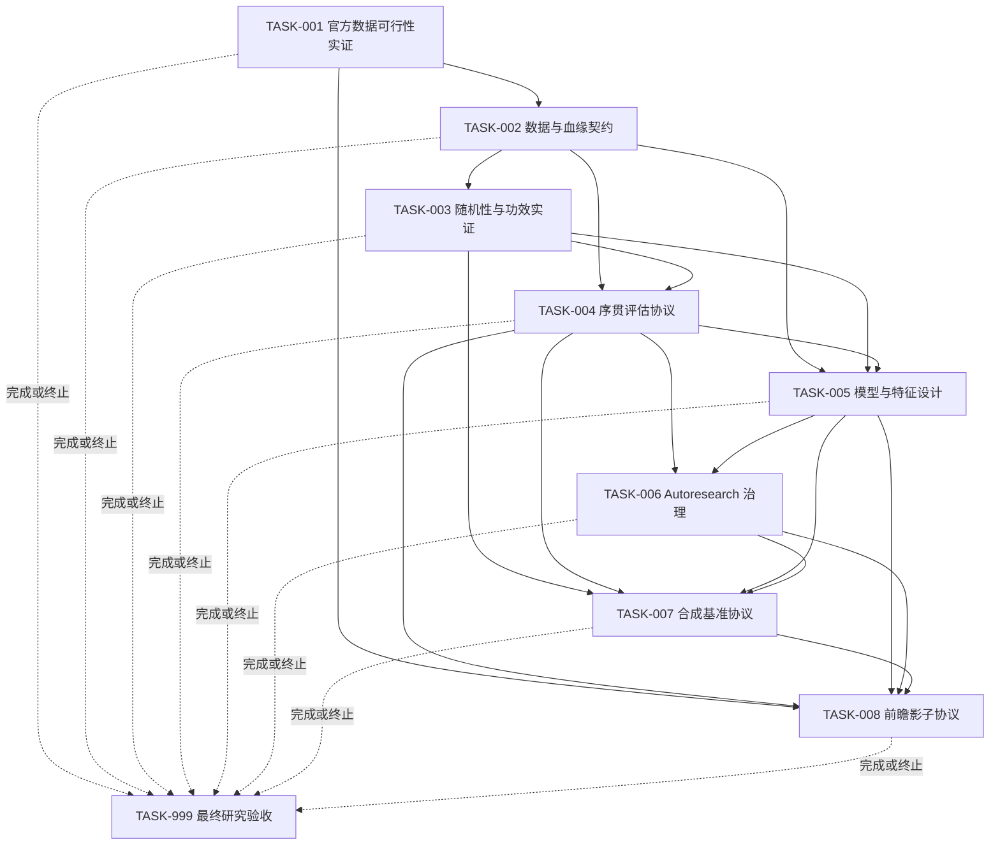

# 彩票 Autoresearch 研究路线图任务说明

## 定位

这是一套执行平台无关的研究路线图。任务能否开始，只取决于领域入口条件和前置证据，不取决于代码托管、分支或任务调度工具。

唯一机器事实源：

- `tasks/research/v1.0.0-lottery-autoresearch-roadmap/research-planning.json`

项目内校验：

```text
python tasks/research/v1.0.0-lottery-autoresearch-roadmap/validate_roadmap.py --roadmap tasks/research/v1.0.0-lottery-autoresearch-roadmap/research-planning.json --contract docs/roadmap/phase-0-acceptance-contract.json
```

## 真实性边界

- TASK-001 是实际数据可行性执行任务，必须产生阶段 0 机器证据。
- TASK-003 是可复现实证统计研究，必须产生仿真代码、制品和重放结果。
- TASK-002、004、005、006、007、008 是研究合同或协议任务，不声称对应系统已经实现。
- TASK-007 只冻结未来合成基准协议，不声称合成基准已经运行。
- TASK-008 只冻结未来前瞻影子协议，不声称已累积真实前瞻优势。
- TASK-999 的 GO 只准入 PRD/HLD，不表示系统已经实现或彩票已经可预测。

## 任务总览

| 任务 | 讲人话的目标 | 类型 | 依赖 | 核心产物 |
| --- | --- | --- | --- | --- |
| TASK-001 | 真的跑完阶段 0，证明官方数据取得、解释、修订和重放可行 | 数据可行性执行 | 无 | 阶段 0 全部机器证据、工具、测试和研究报告 |
| TASK-002 | 写清训练数据、可用时间和更正规则 | 研究契约 | TASK-001 | 规范数据集与血缘契约 |
| TASK-003 | 算清现有样本能检测多小偏差 | 实证研究 | TASK-002 | 功效报告、仿真制品、研究代码和重放 |
| TASK-004 | 冻结持续试验中的模型比较与晋级规则 | 研究协议 | TASK-002、003 | 序贯评估和 Champion 治理协议 |
| TASK-005 | 明确先研究哪些模型和特征、何时增加复杂度 | 研究设计 | TASK-002、003、004 | 模型族、特征注册表和烘焙方案 |
| TASK-006 | 分离提出、执行、复核和批准权限 | 架构协议 | TASK-004、005 | Autoresearch 安全与复核协议 |
| TASK-007 | 冻结未来系统必须通过的合成真假世界和门槛 | 基准协议 | TASK-003、004、005、006 | 合成基准协议 |
| TASK-008 | 规定真实预测如何锁定、评分和准入产品设计 | 前瞻协议 | TASK-001、004、005、006、007 | 前瞻影子协议 |
| TASK-999 | 无论成功、暂停还是停止，都收口证据并给出唯一结论 | 最终研究验收 | TASK-001 至 008 的完成或终止事件 | 最终验收报告、机器决策和独立复核 |

## 执行顺序



当前采用保守串行顺序：TASK-001 → 002 → 003 → 004 → 005 → 006 → 007 → 008 → 999。后续只有在接口和验收面完全冻结后，才可重新审查并行机会。

## 彩种范围与终止流

- TASK-001 在 `stage1-handoff-fixture.json` 中冻结 `active_games` 和 `excluded_games`。只有逐彩种结论为 PASS_FULL 或 PASS_LIMITED 的彩种能进入后续研究；不能把一个彩种的证据推广到另一个。
- 正常路径：TASK-001 至 TASK-008 全部 `passed`，TASK-999 汇总并判断 GO/STOP/HOLD。
- 短路路径：任何任务 `held` 或 `stopped` 后，不再执行的后续任务写入 `skipped_terminal`；TASK-999 仍必须运行并输出唯一结论。
- 每个状态事件固定写入 `artifacts/research/task-states/{run_id}/{task_id}.json`；终止/跳过记录必须包含 run_id、触发任务、状态、原因、证据、责任主体和 UTC 时间。
- TASK-999 收口前，`held` 可在同一 run 补证后重进执行；一旦 TASK-999 已收口，补证必须创建新 run_id，旧 run 的状态和证据不得覆盖。
- TASK-999 按 STOP → GO → HOLD 顺序判断。硬失败优先；只有全部前置任务通过且证据、独立复核均齐全时才能 GO。

## TASK-001 阶段 0 内部工作包

| 工作包 | 讲人话的目标 | 主要证据 | 主要硬门 |
| --- | --- | --- | --- |
| P0-01 | 先锁死验收口径，防止看到结果后改规则 | scope freeze、观察计划、复核人、Schema、验证命令 | G-SCOPE、G-SCHEMA |
| P0-02 | 确认哪些官方来源能合规访问 | 来源目录 | G-AUTHORITY、G-COMPLIANCE |
| P0-03 | 说明每一期适用什么规则和时间含义 | 字段合同、规则 bundle | G-RULES、G-TIME |
| P0-04 | 用最小探针保存原始证据并确定性解析 | 原始载荷、清单、规范记录、环境锁 | G-PROVENANCE、G-PARSE |
| P0-05 | 对冻结区间做全量集合对账和规定核对 | reconciliation、coverage | G-CORRECTNESS、G-COVERAGE |
| P0-06 | 观察真实开奖、注入故障并验证修订恢复 | revision、soak log | G-REVISION、G-RECOVERY |
| P0-07 | 让独立复核人从零重放并验证下游夹具 | replay、handoff fixture、验收报告 | G-REPRODUCIBILITY、G-HANDOFF |

P0-01 未通过时，P0-02 至 P0-07 全部阻塞。

## 任务卡使用方式

每个 `fixtures/TASK-xxx/` 目录包含：

- `PROMPT.md`：任务目标、来源、范围、验收和直接验证命令；
- `AGENTS.md`：通用代理的边界和交接要求；
- `CLAUDE.md`：另一种代理上下文格式。

这些文件只是同一任务合同的不同阅读形式，不参与任务是否可开始的判断。发生冲突时，以 canonical roadmap JSON 为准。

## 独立验收

每个任务必须同时满足：

1. 入口条件有证据；
2. 所有声明产物位于允许输出路径；
3. 每条验收标准都有明确证据路径；
4. canonical roadmap 中列出的直接验证命令通过；
5. 停止条件未被隐藏；
6. 独立复核人未修改被审证据；
7. 交接只包含已通过结论和显式未关闭风险。
8. 报告引用已冻结的复核人凭证、资源预算/超时规则以及 active/excluded 彩种范围。

文档任务的通用报告校验：

```text
python tasks/research/v1.0.0-lottery-autoresearch-roadmap/validate_research_report_quality.py --planning tasks/research/v1.0.0-lottery-autoresearch-roadmap/research-planning.json <report-path>
```

TASK-001 和 TASK-003 还必须运行各自任务卡列出的实证重放命令。文档质量通过不能替代实证验收。

## 最终决策

TASK-999 只能按以下优先级输出一个结果：

- STOP：存在 stopped 任务或无法接受的来源、泄漏、复现、错误率、合规或治理硬失败；
- GO：TASK-001 至 TASK-008 全部 passed，证据和独立复核齐全且无未关闭硬失败；
- HOLD：未触发 STOP，但存在 held、skipped_terminal、证据不足或可修复的不确定性。

GO 不代表系统已经实现，不代表合成基准已经运行通过，不代表真实前瞻模型优于均匀基线，更不代表彩票预测概率可以逼近 100%。
